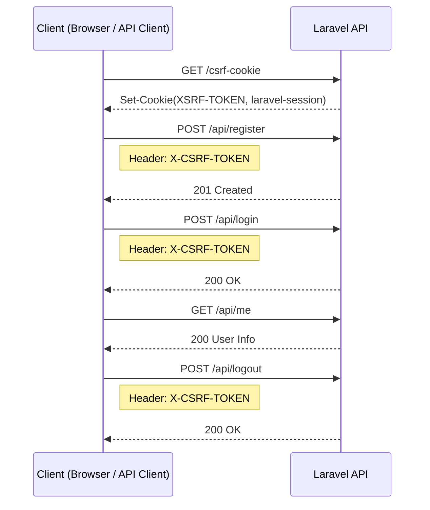

# Auth Flow

このアプリは **Cookieベースのセッション認証 + CSRF保護** を使用する。

## Authentication Sequence

## Flow Summary

1. `GET /csrf-cookie`  
  CSRFトークンとセッションCookieを取得

2. `POST /api/register`  
  ユーザー登録（登録後はログイン状態）

3. `POST /api/login`  
  メールアドレスとパスワードでログイン

4. `GET /api/me`  
  ログイン中ユーザー情報取得

5. `POST /api/logout`  
  セッション破棄
