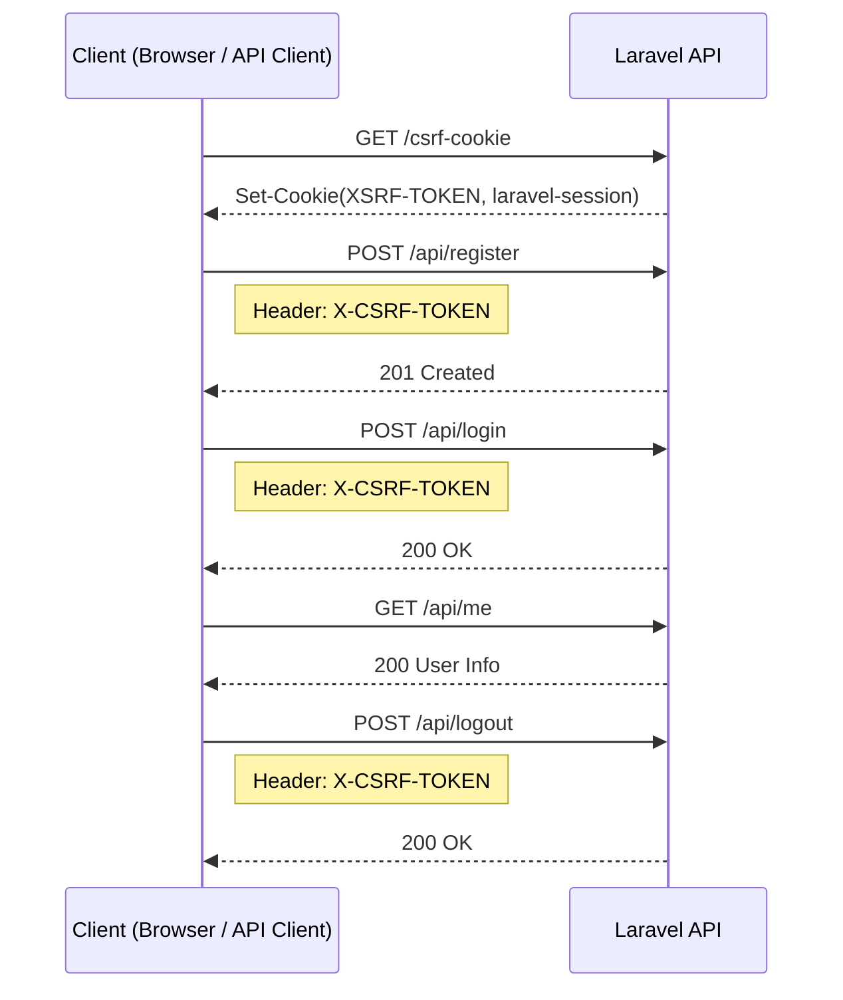

# Auth Flow

このアプリは **Cookieベースのセッション認証 + CSRF保護** を使用する。

## Authentication Sequence

## Flow Summary

1. `GET /csrf-cookie`  
  CSRFトークンとセッションCookieを取得

2. `POST /api/register`  
  ユーザー登録（登録後はログイン状態）

3. `POST /api/login`  
  メールアドレスとパスワードでログイン

4. `GET /api/me`  
  ログイン中ユーザー情報取得

5. `POST /api/logout`  
  セッション破棄

## BFF での CSRF / Session 補助動作

- BFF は `POST / PUT / DELETE` の前に、必要に応じて `/csrf-cookie` から `XSRF-TOKEN` と `laravel-session` を取得する
- 認証切れ後の再ログインで、更新系 API が `419 / CSRF token mismatch` を返した場合は、BFF が CSRF Cookie を再取得して 1 回だけ自動再試行する
- `csrf-cookie` から返る cookie は `XSRF-TOKEN` だけでなく `laravel-session` も含めて BFF が Laravel へ引き継ぐ
- これにより、時間経過でセッションが切れた直後の再ログインでも、古い CSRF / Session の組み合わせによる失敗を吸収しやすくする

## 関連資料

- `docs/architecture/screen-flows.md`
