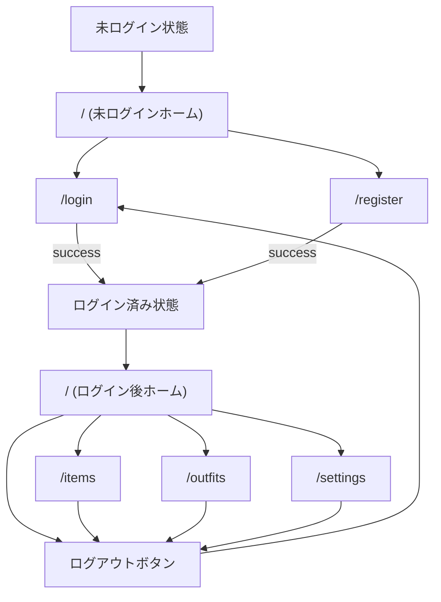
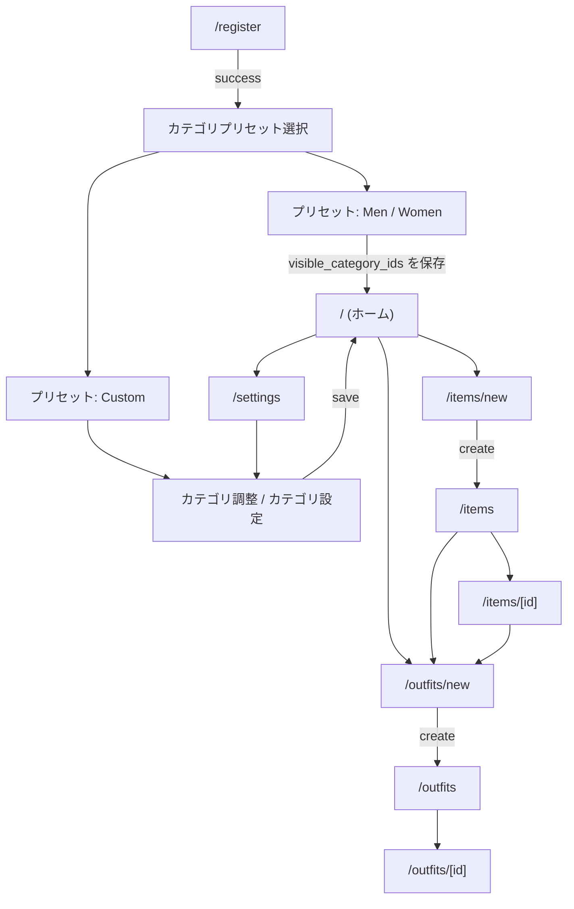

# Screen Flows

この資料は、主な画面導線を Mermaid で確認するための画面遷移図まとめです。

対象:

- ログイン 〜 ログアウト
- 新規登録 〜 カテゴリ設定 〜 item 登録 〜 outfit 登録

---

## ログイン 〜 ログアウト

補足:

- 現在の実装では `login` 成功後は `/` へ、`logout` 後は `/login` へ遷移する
- 未認証で保護画面に入った場合は `/login` へ戻す振る舞いを基本とする

---

## 新規登録 〜 カテゴリ設定 〜 items 〜 outfits

補足:

- この図は、現在の実装と、docs で既に整理済みのカテゴリプリセット導線を含む
- `Custom` ではすぐに確定せず、カテゴリ調整画面で保存する想定
- items が 1 件もない場合は、outfits 新規作成で選択可能なアイテムがないため、先に item 登録が実質的な前提となる

---

## 関連資料

- `docs/architecture/auth-flow.md`
- `docs/specs/settings/category-preset-selection.md`
- `docs/specs/settings/category-settings.md`
- `docs/specs/navigation/global-navigation.md`
