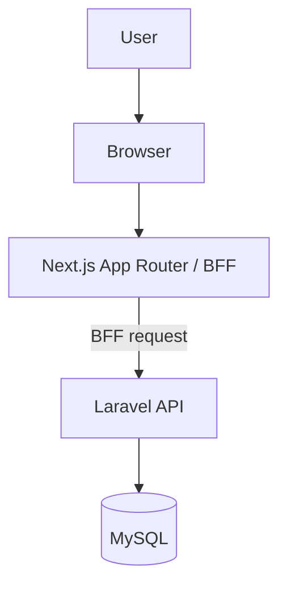

# System Architecture

## Overview

Wardrobe App は、**Next.js と Laravel を分離した構成**で実装されています。

- Next.js: UI と BFF (Backend for Frontend)
- Laravel: 認証、業務 API、DB アクセス
- MySQL: 永続化

フロントエンドは Laravel API を直接呼ばず、基本的に Next.js 側の BFF を経由して通信します。
これにより、ブラウザから見た API の入口を Next.js 側に寄せつつ、Laravel のセッション認証を利用します。

---

## High Level Architecture

---

## Responsibilities

### Next.js

Next.js は次の責務を持ちます。

- 画面表示
- フォーム入力と UI 状態管理
- Route Handler / API Route による BFF
- Laravel API との通信仲介
- Laravel からの `401 Unauthenticated.` を受けてログイン導線へつなぐ

### Laravel

Laravel は次の責務を持ちます。

- 認証処理
- items / outfits の CRUD API
- セッション管理
- バリデーション
- DB 永続化

### MySQL

MySQL はアプリケーションデータの保存先です。

主に次のテーブルを保持します。

- `users`
- `items`
- `outfits`
- `outfit_items`

`items.spec` は JSON カラムで、現在は `spec.tops` を保存対象として使用します。

---

## Request Flow

通常のデータ取得・更新は次の流れです。

1. ブラウザでユーザーが画面操作を行う
2. Next.js のページやコンポーネントが BFF にリクエストする
3. BFF が Cookie / CSRF を含めて Laravel API に転送する
4. Laravel が認証・バリデーション・DB 操作を行う
5. Laravel のレスポンスを BFF 経由でブラウザへ返す

この構成により、フロントエンドはバックエンド実装の詳細を直接持ち込みすぎずに済みます。

---

## Authentication

認証は Laravel の Session Authentication を利用します。

考え方:

- セッションの正本は Laravel 側で管理する
- ブラウザは Next.js を入口として利用する
- Next.js BFF が Laravel への認証付きリクエストを仲介する

未認証時の基本挙動:

- Laravel API は JSON の `401 Unauthenticated.` を返す
- Next.js / フロント側はこれを検知してログイン画面への導線を出す

---

## Main Domain Structure

### Items

服アイテムを管理するドメインです。

主な項目:

- `name`
- `category`
- `shape`
- `colors`
- `seasons`
- `tpos`
- `spec`

現在の実装では、tops カテゴリで `spec.tops` を利用します。

### Outfits

コーディネートを管理するドメインです。

主な項目:

- `name`
- `memo`
- `seasons`
- `tpos`
- `items`
- `sort_order`

---

## Design Notes

現在の構成では、MVP の実装速度と保守性のバランスを優先しています。

- UI と API の責務を分離する
- 認証と DB 操作は Laravel に集約する
- フロントエンドからの通信窓口は BFF に寄せる
- 色・季節・TPO・spec は JSON を使って柔軟に扱う

今後の拡張候補:

- OpenAPI と API 実装の整合強化
- item spec の対象カテゴリ拡張
- 認証フロー資料との相互参照強化
