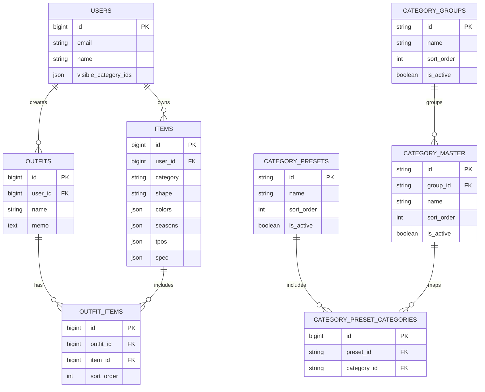

# ER図メモ

README から参照する簡略版 ER 図と、表示方針のメモをまとめます。

---

## README に載せる粒度

今回の ER 図では、全テーブルを網羅するのではなく、読み手が「どのデータが主役で、どうつながっているか」をまず理解できる粒度にします。

表示するもの:

- テーブル名
- 主キー
- 外部キー
- 重要カラムだけ

表示しないもの:

- `created_at` `updated_at`
- cache / jobs など Laravel 標準補助テーブル
- 今の読み手の理解に必須ではない細かい JSON 属性

---

## 簡略 ER 図（Mermaid）

---

## 補足

- `users.visible_category_ids` で、ユーザーごとのカテゴリ表示 ON/OFF を保持します
- `items` は 1 ユーザーに属する単体の服データです
- `outfits` は 1 ユーザーに属するコーディネートで、`outfit_items` を通じて複数 item と紐づきます
- カテゴリは `category_groups` → `category_master` の 2 段構造で持ち、プリセットとの関係は `category_preset_categories` で管理します

---

## 将来の拡張メモ

- 着用履歴を追加するときは `wear_logs` 系テーブルを別途追加する想定です
- 画像アップロード対応時は `item_images` などの分離テーブルを検討します
- README に載せる画像版 ER 図は、dbdiagram または draw.io で別途作成する想定です

---

## 関連資料

- `README.md`
- `docs/data/database.md`
- `docs/specs/wears/wear-logs.md`
- `docs/data/er-diagram.dbml`
