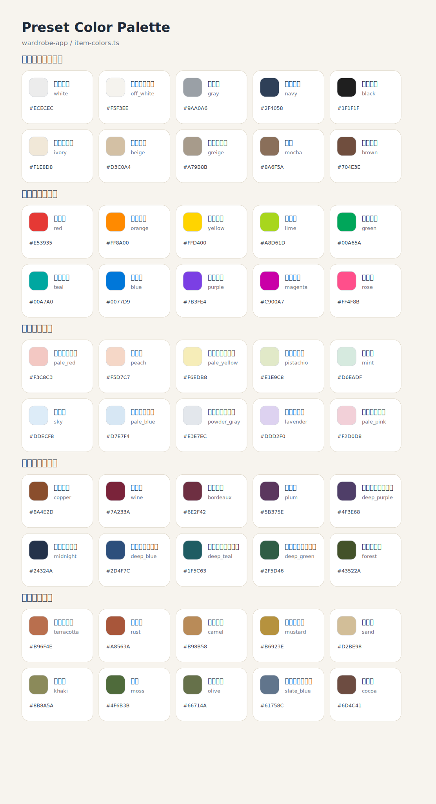

# Wardrobe App 作業メモ

このファイルは、現在の実装状況と次に着手する内容を共有するための引き継ぎメモです。
設計の正本は `docs/` 配下の各資料を参照し、日々の実装状況と判断メモはこのファイルに集約します。
このファイルでは、現状の実装・引き継ぎ事項・短期の確認タスクを優先して扱います。中長期の新規機能候補や優先順位は `docs/specs/planning/next-features.md` に分離し、このファイルでは重複して詳説しません。

実装着手前の確認観点を見返すときは `docs/project/implementation-checklist.md` を参照します。
docs の表現ルールを確認するときは `docs/project/docs-writing-guidelines.md` を参照します。
item status 変更仕様の正本を確認するときは `docs/specs/items/status-management.md` を参照します。
item 詳細画面での status 操作 UI を確認するときは `docs/specs/items/detail-status-ui.md` を参照します。
購入検討の仕様正本を確認するときは `docs/specs/purchase-candidates.md` を参照します。
購入検討の API 入口を確認するときは `docs/api/api-overview.md` を参照します。
action keyword と response schema の命名ルールを確認するときも `docs/api/api-overview.md` を参照します。
OpenAPI に明示する error response の基準を短く見返すときも `docs/api/api-overview.md` を参照します。
422 response と `ValidationErrorResponse` の使い分けを確認するときも `docs/api/api-overview.md` を参照します。
401 / 404 の読み分けルールを確認するときも `docs/api/api-overview.md` を参照します。
409 と業務ルール違反系 422 の使い分けを確認するときも `docs/api/api-overview.md` を参照します。
400 / 429 / 500 を docs でどこまで明示するかの方針を確認するときも `docs/api/api-overview.md` を参照します。
購入検討の DB 保存方針と `purchase_candidate_images` / `item_images` の関係を確認するときは `docs/data/database.md` を参照します。
主要 spec の索引から購入検討を含む資料一覧へ辿るときは `docs/specs/README.md` を参照します。
購入検討の OpenAPI 定義は `docs/api/openapi.yaml` に反映済みで、現状の実装との差分確認はこのファイルを起点に行います。
ブランド候補の仕様正本を確認するときは `docs/specs/settings/brand-candidates.md` を参照します。
素材・混率の仕様メモを確認するときは `docs/specs/items/material-composition.md` を参照します。
settings / calendar / wear logs / care_status の後続設計メモを見返すときは `docs/specs/settings_calendar_wearlog_codex_plan.md` を参照します。
thumbnail の現状確認用パターン一覧を見返すときは `docs/specs/items/thumbnail-current-reference.md` を参照します。
画面ヘッダー周辺デザインの整理メモを見返すときは `docs/specs/ui/page-header-guidelines.md` を参照します。

## 削除導線の共通方針

- 一覧画面は原則として「確認・遷移」を主責務とし、操作導線は最小限に留める
- 削除導線は原則として一覧には置かず、詳細画面または編集画面に置く
- 詳細画面が未実装の機能は、当面編集画面を削除導線の配置先とする
- 削除前には誤操作防止の confirm を入れ、高頻度削除が必要な機能だけ例外扱いを検討する
- wear logs は 現時点では個別詳細を主導線とし、編集画面側にも footer action として削除導線を維持してよい

## 直近タスク

この節には「直近の確認と引き継ぎに必要なもの」だけを残し、中長期の新規機能候補は `docs/specs/planning/next-features.md` を正本とします。

優先順:

1. docs 正本の整合確認を続ける
   - `docs/specs/wears/wear-logs.md`
   - `docs/specs/outfits/create-edit.md`
   - `docs/data/database.md`
   - `docs/api/openapi.yaml`
     の間で、仕様 / DB / API のズレがないか確認する
2. 各画面のエラーメッセージと空状態を整理する
   - 未反映画面と細かな文言差分を引き続き詰める
3. ログ設計の方針を整理する
   - アプリケーションログと一部イベントログの方針を詰める
   - item `disposed` / outfit `invalid` / 将来の wear logs 状態変更で何を残すか整理する
4. スマホ実機でキーワード検索入力と IME 変換が安定するかを確認する
   - Safari 実機が必要なら追加確認する
5. item SVG の簡略化方針を docs と画面で揃える
   - tops / `onepiece_allinone` の item SVG は shape 個別表現を増やさず、カテゴリ単位の記号化を維持する
6. item `care_status` の後続整理
   - item 一覧で `in_cleaning` の絞り込みを追加するか検討する
7. 各画面ヘッダー周辺デザインの見直し
   - 仕様メモは `docs/specs/ui/page-header-guidelines.md` を正本にする
   - パンくず / 小見出し / メイン見出し / 説明文 / 補助リンク / 件数表示 / 主要アクションの置き方を画面横断で揃える
   - 一覧画面どうし、詳細画面どうしでヘッダー周辺の余白・見出しサイズ・境界線・カード上端の情報構造を共通ルール化する
   - 現状の UI は情報整理はできているが、やや単調で古く見えやすいため、シンプルさは維持しつつもう少しモダンで整った印象へ寄せる
   - 場当たりの装飾追加ではなく、保守しやすい共通化前提で整理する
8. 一覧ページングの横断整備
   - 優先度: 高
   - 背景: 一覧ごとの差があり、purchase candidate 一覧のページング UI が弱い
   - やりたいこと: 一覧ページのページング UI / 表示条件 / 共通性を整理する
9. form field error 表示の横断整備
   - 優先度: 高
   - 背景: item / purchase candidate は項目単位エラーが比較的厚い一方、outfit / wear log は上部メッセージ寄りで横断パターンが揃っていない
   - やりたいこと: form error の表示ルールを揃え、少なくとも項目紐づけ可能なものは項目近くに出せるよう整理する

## 購入検討 実装メモ

位置づけ:

- 購入検討の正本は `docs/specs/purchase-candidates.md` を参照する
- 初期実装範囲として candidate 保存・画像管理・item draft 導線まで実装済み
- item 側では `brand_name / price / purchase_url / purchased_at / size_* / is_rain_ok / item_images` の受け皿まで実装済み
- candidate 由来画像は item 保存時に item 用保存先へ物理コピーし、`item_images` にはコピー先の `disk + path` を保存する
- 購入検討の画像追加 UI は file select / drag & drop / paste に対応済み
- 購入検討一覧では代表画像、詳細・編集では画像全体確認を優先する表示へ整理済み
- 購入検討でも一覧 → 詳細 → 編集 の責務分離を採用し、一覧は確認・遷移、編集は詳細画面からを主導線に整理済み
- 購入検討で導入した `必須` バッジを items / outfits / wear logs の主要フォームにも揃え、必須項目をラベル上で事前判別できるようにした
- item 作成時に `purchase_candidate_id` を受け取り、Laravel 側で candidate の `purchased` 反映と `converted_item_id` / `converted_at` 更新まで処理する
- `sale_price` / `sale_ends_at` は購入検討専用の補助情報として create / edit / list / detail まで実装済み
- candidate 複製機能は詳細画面から使える 現時点で実装済みの機能として実装済みで、colors / seasons / tpos / images を引き継ぎ、画像は新 candidate 用保存先へ物理コピーする
- 色違い対応の DB 基盤として `purchase_candidate_groups` と `purchase_candidates.group_id` / `group_order` を追加済み。
  `group_order` は group 内表示順の正本とし、`group_id + group_order` の重複は DB 制約で禁止する
  色違い追加 API / 詳細導線は実装済み。draft 開始時は元 candidate を更新せず、新 candidate 保存時に group を解決する
- 色違いグループの一覧束ね表示は実装済み。詳細画面の同 group 候補表示は後続で扱う
- `purchased` の購入検討は item 化済み履歴として扱い、candidate 側更新を item へ逆流させない
- `purchased` の購入検討では `memo` / `wanted_reason` / `priority` / `sale_price` / `sale_ends_at` / `purchase_url` / 画像のみ更新可とし、item-draft 導線は表示しない
- 比較ロジックの詳細は後続検討とする
- candidate `memo` は 現時点で item 作成画面の `memo` 初期値へ引き継ぎ、保存後は candidate / item で独立管理とする
- purchase_candidates の create / edit でも `size_note` をサイズ感・着用感メモ、`size_details` を `structured` / `custom_fields` を持つ構造化実寸として入力できる
- purchase_candidates のサイズ実寸 UI は items 側の `item-size-details-fields.tsx` と `size-details.ts` を再利用し、item draft でも `size_details` をそのまま引き継ぐ
- purchase candidate の create / edit は 現時点で 1 枚カードにまとまっているため、後続では item 新規作成に寄せて `基本情報 / 購入情報 / メモ / サイズ・属性 / 素材・混率 / 色 / 季節 / TPO / 画像` をセクションカード分離する方針を優先する
- item / purchase candidate のカテゴリ入力 UI はどちらも整理途中であり、candidate 側だけを場当たりで直さず、カテゴリ入力 UI 全体を見直す後続 task として扱う
- 後続では分類体系・選択の段階構造・表示ラベル・候補の並び・未選択時の見せ方・item 化後にどのカテゴリへ入るかの対応関係を揃える前提で整理する
- 画面用途ごとの差は残してよいが、少なくとも同じカテゴリ体系を同じ意味で選んでいると分かる状態を目指す
- item 側カテゴリ UI も完成扱いにせず、purchase candidate 側と合わせて後で着手が必要な設計課題として保持する

直近または中期 将来タスク:

1. item draft と item 昇格後の追従を整理する
   - draft は保存済み item ではなく item 作成画面用の初期値 payload とする
   - item 作成後に candidate へ戻る導線や、重複昇格をどう扱うかを後続整理する
2. 画像アップロード方針を整理する
   - candidate 側の複数画像 upload / delete は実装済み
   - candidate -> item の保存時引き継ぎは実装済み
   - item 側画像 upload / delete UI は実装済み
   - item 側では並び替え / 代表画像切り替え UI まで実装済み
   - candidate 側の並び替え / 代表画像切り替え UI と保存後の編集責務分離を整理する
2-1. 対応済み: 購入検討から item 作成へ進んだ時の画像表示整理
   - 現状: item 新規 / 編集では、左を画像操作の正本、右を最終確認プレビューとして整理済み
   - 補足: 購入検討由来画像は item 側初期値として扱い、右側の重複画像確認 UI は解消済み
2-2. 対応済み: 購入検討の複製後導線見直し
   - 現状: duplicate は保存前 payload を返して新規作成画面へ遷移する方式へ整理済み
   - 補足: 保存前に record は増えず、`（コピー）` 付き初期値で新しい購入検討として再利用できる
3. 比較結果の扱いを整理する
   - 現時点では補助表示前提とし、比較ロジックの詳細や強い自動判定は後続検討とする
4. 月次服飾費集計の前提を残す
   - `items.purchased_at` を持たせる案をベースに、item の `price` と組み合わせて集計できるようにする
5. ナビゲーション整理
   - 購入検討はボトムナビへ追加済み
   - wear logs も主要導線としてボトムナビへ追加済み
6. 購入検討の残課題整理
   - ホーム sale 表示は将来検討として切り分ける
   - candidate 側の並び替え / 代表画像切り替え UI を後続整理する
7. 購入検討新規作成画面のブランド入力を item 側とそろえる
   - 種別: UI/UX改善
   - 優先度: 中
   - 背景: 購入検討新規作成画面のブランド入力が item 側の入力体験とそろっておらず、ブランド候補の扱いや入力補助の一貫性に改善余地がある
   - やりたいこと: 購入検討新規作成画面のブランド入力を item 側の使い方・見え方に寄せ、候補表示・自由入力・将来的なブランド候補連携の整合を取りやすくする
   - 保留事項:
     - 新規作成だけ先にそろえるか、編集画面も同時にそろえるか
     - item 側と完全一致にするか、purchase candidate 用に軽量調整を残すか
8. 購入検討一覧の絞り込み / サムネイル表示見直し
   - 種別: UI/UX改善
   - 優先度: 中
   - 背景: 購入検討一覧画面では keyword / status / priority / category / sort / brand の基本フィルターとページング UI までは実装済みだが、一覧探索の使い勝手やサムネイル画像の大きさには見直し余地がある。item 側と揃えて SVG 画像を表示させるかは方針検討が必要
   - やりたいこと: 購入検討一覧に必要な絞り込み・フィルターを整理し、サムネイル画像サイズを見直したうえで、item 一覧との表示方針差と SVG 表示をそろえるか検討する
   - 保留事項:
     - どの filter を最低限入れるか
     - 実画像優先か、SVG / プレースホルダー優先か
     - item 一覧と完全にそろえるか、purchase candidate 用に別方針を持つか
   - 補足: 購入検討一覧の brand フィルター候補は、ブランド候補設定に登録されたブランド名と、既存の購入検討データに含まれるブランド名を統合して生成する。目的は入力補助ではなく一覧で既存データを探しやすくすることであり、フォームのブランド候補と完全一致しなくてよい。候補整形は少なくとも trim・空文字除外・重複除去を行い、大文字小文字や表記ゆれの完全統一は将来課題とする。
8-1. 対応済み: 購入検討一覧の filter UI とカード比較性の整理
   - 現状: 購入検討一覧では keyword / status / priority / category / subcategory / sort / brand の filter UI とページング UI を一覧上で自然に使える形へ整理済み
   - 補足: category は親カテゴリ、subcategory は category 選択後だけ有効な current 語彙の種類として扱う
   - 補足: brand フィルターは一覧探索用の候補として、ブランド候補設定と既存の購入検討データに含まれるブランド名を統合している
   - 補足: サムネイルは実画像優先を維持しつつ、画像なしカードではカテゴリ / ブランドの補助表示を残し、商品ページリンクは外部リンクとして控えめに整理済み
   - 補足: カラーチップは一覧比較の補助情報として維持し、価格情報は比較しやすいよう主役寄りに整理済み
8-2. 対応済み: 購入検討一覧の色違い group 表示
   - 現状: 同じ `group_id` を持つ購入検討は、一覧上で 1 カードに束ねて表示する
   - 補足: 初期表示は `group_order` 最小の candidate を使い、色チップは `group_order asc` で並べる
   - 補足: チップ切り替え時は、カード内の画像 / 名前 / ブランド / 価格 / sale 情報 / status / priority / 詳細リンクを選択中 candidate に合わせて切り替える
   - 補足: 一覧カードでは、選択中 candidate の複数画像を左右矢印で切り替え、画像位置は `1/n` 表示で補足する。色違いチップで別 candidate へ切り替えた場合は、その candidate の先頭画像へ戻す
   - 後続: group / non-group を含む購入検討カード全体の再設計は別TODOとし、今回は `色違い n件` ラベル、画像直下の色チップ切替、画像切替導線までを現行到達点とする
   - 後続: 詳細画面の同 group 候補表示、group 内 purchased の見せ方、並び替え UI は未実装

既存仕様との衝突確認メモ:

- 購入検討は items / outfits / wear logs と責務を分け、candidate を outfits に直接混ぜない前提を維持する
- `dropped` は見送り履歴を残す状態であり、DELETE は登録ミスや重複削除用として役割を分ける
- candidate から item へ全画像を引き継ぐ方針は UX 上は自然で、保存時には item 用保存先へ物理コピーする
- item 側画像と別管理である点を UI 上でも誤解されないよう整理が必要
- `size_gender` の内部値は `women / men / unisex` を想定しており、カテゴリプリセットの `male / female / custom` 命名とズレるため、表示ラベル変換ルールを後続整理したい
- items は現行 DB で `colors / seasons / tpos` を JSON で持つが、purchase_candidates 実装時は API / `item-draft` を配列で統一し、Laravel 側で構造差を吸収する
- candidate は `category_id` を正本にしつつ、`item-draft` では 現在の item API 用の `category` / `shape` を返す前提とする

## purchase_candidates 実装着手前メモ

### 今回固定する前提

- `item-draft` は現在の `POST /api/items` に合わせた初期値 payload とし、frontend がそのまま item 作成画面へ流し込める形を優先する
- candidate 側の正本カテゴリは `category_id` とし、item 作成用の `category` / `shape` へのマッピングは Laravel 側で行う
- `colors` / `seasons` / `tpos` は DB 構造差があっても API と `item-draft` では配列で統一する
- candidate 画像は item 作成初期値へ全件引き継ぐが、保存時に item 用保存先へ物理コピーし、保存後は `item_images` として別管理にする
- `wanted_reason` は candidate 側の情報とし、item `memo` へ自動結合しない

### まだ保留でよい前提

- items 側を `item_colors` / `item_seasons` / `item_tpos` の別テーブルへ移行するか
- `category_id` から 現在の item API の `category` / `shape` を解決できないカテゴリが出た場合の API 拡張方針
- 比較ロジックの詳細と、比較結果をどの粒度で response に含めるか

### 実装時の注意点

- frontend / BFF にカテゴリ変換ロジックを分散させない
- OpenAPI には API 入出力と 今後対応の schema を書き、実装順・責務分担・保留事項は implementation-notes に寄せる
- `今後対応` だが設計済みの API は OpenAPI に残し、実装済みかどうかの管理は implementation 系 docs で行う
- DB 構造差を吸収する変換は Laravel 側 service / mapper に閉じ、画面側では配列 payload を正本として扱う

## ナビゲーション実装メモ

- 購入検討は主要導線としてボトムナビへ追加済み
- wear logs は主要導線としてボトムナビへ追加済み
- 現状のボトムナビ順序は ホーム / アイテム / コーディネート / 購入検討 / 着用履歴 / 設定
- `/wear-logs` 配下では着用履歴タブを active とする
- wear log form では item / outfit の中身確認を詳細画面への導線で補い、フォーム自体に詳細責務を持たせすぎない

## 実装着手前チェックリスト

### docs 上で決定済み

- Item status の 現在のルールは `docs/specs/items/status-management.md` を正本とする
  - `status = active / disposed`
  - `disposed` は通常一覧・outfit・wear logs 候補から除外
  - `reactivate` しても related outfit は自動 `restore` しない
  - item 詳細画面で `dispose` / `reactivate` の専用操作導線を実装済み
  - 通常 UI では物理削除を主操作に置かず、`手放す` / `クローゼットに戻す` を所有状態変更の主導線として扱う
  - 物理削除 API は例外用途として残すが、`outfit_items` / `wear_log_items` 参照がある item は削除拒否とする
  - `disposed` item の dedicated 一覧として `GET /api/items/disposed` と `/items/disposed` を実装済み
- Item の補助状態として `care_status = in_cleaning | null` を持ち、補助バッジ・警告・解除導線に使う
  - 詳細画面の UI / 導線は `docs/specs/items/detail-status-ui.md` を参照
  - 候補除外や invalid 化の主制御には使わない
- Outfit の `status` は `active` / `invalid` とし、通常保存では `status` を payload に含めない
  - 正本: `docs/specs/outfits/create-edit.md`, `docs/data/database.md`, `docs/api/openapi.yaml`
- wear logs は `source_outfit_id` を「ベースにした outfit」として持ち、最終的な item 構成は `items` / `wear_log_items` を正本とする
  - 正本: `docs/specs/wears/wear-logs.md`, `docs/data/database.md`, `docs/api/openapi.yaml`
- `item_source_type` は `outfit` / `manual`、`current status` は補助情報として扱う
  - 正本: `docs/specs/wears/wear-logs.md`, `docs/api/openapi.yaml`

### 現状の実装

- `invalid outfit` では `GET /api/outfits/invalid`、`POST /api/outfits/{id}/restore`、`POST /api/outfits/{id}/duplicate` は実装済み
- wear logs の API / DB / UI は一覧 / 詳細 / 登録 / 更新 / 削除まで実装済み
  - 一覧 → 詳細 → 編集 の責務分離を前提とする
  - 削除導線は個別詳細に置き、編集画面側にも footer action として維持してよい
  - 正本: `docs/specs/wears/wear-logs.md`, `docs/data/database.md`, `docs/api/openapi.yaml`

### 今後対応

- wear logs の残タスクの中心は snapshot
  - 正本: `docs/specs/wears/wear-logs.md`, `docs/data/database.md`, `docs/api/openapi.yaml`
- event log は `disposed / invalid / restore / duplicate` を優先対象としているが未実装
  - 正本: `docs/specs/logging/logging-policy.md`

### `将来タスクの API`

- wear logs 関連の 将来タスクの API は現時点ではなし

### 副作用あり

- item を `disposed` にすると、その item を含む `active outfit` は `invalid` に遷移する
  - 正本: `docs/specs/outfits/create-edit.md`, `docs/data/database.md`
- item が `active` に戻っても outfit は自動 `restore` しない
  - 正本: `docs/specs/outfits/create-edit.md`, `docs/api/openapi.yaml`
- 手動 `restore` は対象 outfit が `invalid` で、構成 item がすべて `active` の場合のみ許可する
  - 正本: `docs/specs/outfits/create-edit.md`, `docs/api/openapi.yaml`
- `duplicate` は保存済み outfit ではなく、新規作成画面へ渡す初期値 payload を返す
  - invalid outfit 由来の `disposed` item は `selectable=false` と `note` で返す
  - 正本: `docs/specs/outfits/create-edit.md`, `docs/specs/outfits/item-candidate-rules.md`, `docs/api/openapi.yaml`
- `disposed item` / `invalid outfit` は wear logs の新規登録・更新候補から除外する
  - 正本: `docs/specs/wears/wear-logs.md`, `docs/data/database.md`, `docs/api/openapi.yaml`
- `in_cleaning` item は wear logs の新規登録・更新候補から除外せず、planned / worn ともに保存可能とし、UI では警告のみを表示する
  - 正本: `docs/specs/wears/wear-logs.md`, `docs/api/openapi.yaml`
- wear log の削除は個別詳細を主導線として行い、関連 `wear_log_items` も合わせて物理削除する
  - 編集画面側にも footer action として削除導線を維持してよい
  - 他レコードの `display_order` 自動再採番は行わない
  - 正本: `docs/specs/wears/wear-logs.md`, `docs/api/openapi.yaml`

## 現状の実装メモ

### recent performance improvements

- ホーム件数取得は、一覧 API 4 本を件数目的で呼ぶ 現状をやめ、`GET /api/home/summary` の軽量 endpoint へ置き換えた
- `UserTpoNameResolver` は user ごとの name map を一括構築して使い回す形に寄せ、items / outfits 一覧で `user_tpos` をレコードごとに引き直さないようにした
- `ItemsIndexQuery` / `OutfitsIndexQuery` / `WearLogsIndexQuery` / `PurchaseCandidatesIndexQuery` は、可能な範囲で `filter / sort / paginate` を DB query builder 側へ寄せた
- 上記は一覧 API の仕様変更ではなく、現状のレスポンス形と filter 条件を維持した内部最適化として実施した
- 残課題は、auth 確認や `no-store` の多用、一覧画面の追加 fetch の見直し、production build を含む実測確認、必要に応じた query log ベースの再調整

### settings

実装済み:

- `GET /api/settings/categories` で現在のカテゴリ表示設定を取得できる
- `PUT /api/settings/categories` で `visible_category_ids` を保存できる
- `GET /api/settings/preferences` / `PUT /api/settings/preferences` を実装済み
- `GET /api/settings/tpos` / `POST /api/settings/tpos` / `PATCH /api/settings/tpos/{id}` を実装済み
- `user_preferences` に `currentSeason` / `defaultWearLogStatus` / `calendarWeekStart` / `skinTonePreset` を保存できる
- `user_tpos` にユーザーごとの TPO 選択肢正本を保存できる
- ユーザー作成時に、`user_tpos` へプリセット `仕事 / 休日 / フォーマル` を初期投入する
- `user_tpos` 導入 migration で当時の既存ユーザーを backfill し、`ensurePresets()` は runtime 防御コードとして残す
- 役割分担は、migration が導入前ユーザーの一括補完、ユーザー作成時初期投入が正本、`ensurePresets()` が想定外欠損の救済用
- settings トップは `currentSeason` / `defaultWearLogStatus` / `calendarWeekStart` / `skinTonePreset` の取得・保存と、各設定画面へのハブとして動作する
- `/settings/categories` でカテゴリ表示設定の取得・保存ができる
- `/settings/tpos` で TPO 一覧 / 追加 / 有効無効切替 / 上下移動 / 追加 TPO の名称編集ができる
- `/settings/brands` でブランド候補一覧 / 追加 / 編集 / 有効無効切替ができる
- settings 配下の操作系アイコンは `web/src/lib/icons/settings-icons.ts` に寄せ、現状は TPO 画面で使っている
- create / edit / list のカテゴリ候補は、保存済みのカテゴリ表示設定を考慮する
  - 新規作成では ON の大分類だけをカテゴリ候補に出す
  - 一覧では ON の大分類だけをカテゴリ絞り込みに出す
  - 編集では基本は ON の大分類だけを出す
  - ただし編集中のアイテムが現在 OFF のカテゴリだった場合は、そのカテゴリだけは残す
- items 一覧では、OFF にしたカテゴリのアイテム自体も一覧表示から外す
- items 一覧では、通常一覧とクローゼットビューの表示切替を持ち、検索・絞り込み・並び順条件を維持したまま切り替えられる
- クローゼットビューは category master の中分類単位で表示しつつ、その中を shape 単位でもう一段グルーピングして、`active` item のみを色付き図形で横並びベースに表示する
- クローゼットビューの色順は shared utility で HSL 正規化し、無彩色先行・彩色は `hue asc -> lightness asc`・色欠損は末尾で安定化している
- TPO の選択肢正本は `user_tpos` とし、Phase 1 では settings + item + outfit を ID ベースで接続済み
- item / outfit は `tpo_ids` を保存正本とし、`tpos` は表示用の resolved name として返す
- inactive TPO は新規候補に出さず、既存 item / outfit に含まれる場合は表示・保持できる

### 現時点の方針: カテゴリ表示設定を JSON に寄せすぎない

- 現在の保存正本は `users.visible_category_ids` とし、`GET /api/settings/categories` / `PUT /api/settings/categories` もこの保存形式を前提に維持する
- ただし、これは「中分類の表示可否だけを持つ現行仕様を支える現行実装」であり、大分類 ON/OFF、中分類 ON/OFF、表示順、onboarding プリセット、一覧絞り込み候補、作成 / 編集候補を JSON のまま増やし続ける前提にはしない
- `user_settings` は全体設定に寄せ、カテゴリ表示設定は将来的に `user_category_settings` のような専用テーブルへ分離する方向を第一候補とする
- 将来の行単位の正本では、カテゴリ master の階層は `category_groups` / `category_master` をそのまま使い、ユーザー側は `user_id + category_id` 単位で表示可否や将来の拡張項目を持つ想定とする
- onboarding のプリセット選択は、最終的には `user_category_settings` の初期投入で表現する方向を優先し、登録直後の保存と通常設定変更をできるだけ同じ責務で扱える形を目指す
- 今すぐ全面移行はしないが、カテゴリ設定に新しい保存項目を足す場合は `visible_category_ids` へ安易に追加せず、専用テーブル案と比較してから進める
- 将来検討の論点は、中分類行の初期投入方法、表示順の保持要否、一覧絞り込み候補 / 作成・編集候補 / 既存データ表示での参照ルール共通化、`user_settings` とカテゴリ専用設定の責務境界とする
- カテゴリ体系見直しメモ:
- 現行の `category_groups` / `category_master` は初期実装としては成立しているが、実運用を考えると `ボトムス`、`ワンピース・オールインワン`、`小物` の粒度が粗い
- 次回再編の第一候補は、大分類を `tops`、`outerwear`、`pants`、`skirts`、`onepiece_dress`、`allinone`、`roomwear_inner`、`legwear`、`shoes`、`bags`、`fashion_accessories`、`swimwear`、`kimono` に寄せる案とする
- 実装第1弾では `swimwear` と `kimono` を含む大分類までを対象にし、settings / onboarding / purchase candidate の `category_id` と表示対象判定まで一貫して追随する
- 中分類は「大分類で責務を分け、中分類では一般的な登録名を持ち、詳細シルエット差は item 側 `shape` や spec へ寄せる」方針を優先する
- 影響が大きいのは seed だけではなく、`settings/categories`、onboarding プリセット、item / outfit / purchase candidate の create-edit 候補、一覧絞り込み候補、`category_id -> category / shape` 変換、クローゼットビューのカテゴリ / shape 表示である
- `バッグ` と `ファッション小物` は、第1弾で item 側の現在カテゴリも分ける。`bags` はバッグ本体、`fashion_accessories` は帽子・ベルト・マフラー・ストール・手袋・アクセサリー・財布・カードケース・ヘアアクセサリー・眼鏡・サングラス・腕時計・その他を持つ前提にする
- purchase candidate の `category_id` は Laravel 側で item の `category` / `shape` へ変換しているため、中分類追加だけでなく大分類再編でも `PurchaseCandidateCategoryMap` と frontend 側 category map の同時更新が必要になる
- 実装第1弾では category master の中分類 ID は新案へ寄せつつ、item の `category` / `shape` も `bags`・`fashion_accessories`・`swimwear`・`kimono` は新案側へ進め、`bottoms` / `outer` / `onepiece_allinone` などは必要な箇所だけ対応表で橋渡しする
- 実装第2弾では item の現在カテゴリも `pants`・`skirts`・`outerwear`・`onepiece_dress`・`allinone` を正本寄りに扱い始め、一覧候補・表示対象判定・purchase candidate の item-draft 生成は新しい category 値を優先する
- `パーカー・スウェット`、`キャミソール・タンクトップ`、`ワンピース・ドレス`、`バッグ・小物` は現行の命名や責務が曖昧で、一覧比較や settings 表示でも後から説明しづらくなるため、分類再編時に優先して解消する
- `水着` と `着物` は通常衣類に混ぜるより独立大分類へ置く方が settings と onboarding で扱いやすい
- `shape / spec` はカテゴリ再編の受け皿として使う前提だが、現時点でかなり具体化されているのは `tops` と `spec.bottoms.length_type`、`spec.legwear.coverage_type` までであり、`pants` / `skirts` / `outerwear` / `onepiece_dress` / `allinone` / `bags` / `kimono` は「壊れない最小限の shape / spec」まで追随済み、全面再設計は後続に残す
- 現時点の整理では、`category` は用途・売り場・一覧探索の単位、`subcategory` は種類名として定着した下位分類、`shape` は同じ `category` / `subcategory` 内での見た目・構造・型の差、`spec` は丈・覆い方・機能・補助属性を持つ責務とする
- categories 設定で扱う中分類 ID は、当面 `subcategory` に相当するものとして読み、`shape` / `spec` は ON / OFF 対象へ広げない
- 内部で shape を使わないカテゴリであっても、内部では shape を保持してよい
- その内部 shape は、ユーザー入力の正本ではなく、互換・保存・复元・bridge のための補助値として扱う
- 現時点ではカテゴリごとに空文字 / fallback / 内部保持が混在しているが、これらをカテゴリ個別で解消しない
- 将来的には NULL または未指定を許容する横断再設計を検討し、shape 未指定の扱いをカテゴリ横断でまとめて行う
- その再設計はカテゴリ個別で進めるのではなく、カテゴリ横断の shape 未指定 / NULL 許容方針としてまとめて判断する
- allinone はその代表例だが、固有の shape 未指定 / NULL 許容方針の判断対象の一部として位置づける
- `subcategory` は item モデルの独立カラムとして段階導入済みとし、値は `tops_hoodie` のような中分類 ID そのものではなく `hoodie` のような単体値で持ち、意味は `category` と組み合わせて読む
- settings 側の中分類 ID とは、`pants_denim` ⇔ `category = pants` かつ `subcategory = denim` のように対応づける前提を優先する
- `subcategory` は全カテゴリで一律必須にはせず、まず `tops`、`pants`、`outerwear`、`onepiece_dress`、`allinone`、`bags`、`fashion_accessories`、`shoes` を中心に UI へ導入し、`skirts`、`kimono` は代表カテゴリまたは `null` 許容で始める
- create / edit は原則 `カテゴリ / 種類 / 形 / 詳細` の並びへ寄せ、`shape` 候補は `category` だけでなく `subcategory` に応じても出し分ける前提を優先する
- 旧データは一括で完全移行する前提にはせず、安全に補完できるものだけデータ補完し、補完できないものは `subcategory = null` を許容して UI 側 fallback で吸収する。現在の item 詳細 / 一覧 / disposed 一覧では `subcategory` を優先表示し、未設定時は bridge で補助する
- lower-body 系は、`pants` / `skirts` とも丈を原則 `spec` に寄せ、テーパード / フレアのような型差は `shape` に寄せる
- `pants` は `pants_pants`、`pants_denim`、`pants_slacks`、`pants_cargo`、`pants_chino`、`pants_sweat_jersey`、`pants_other` を中分類の第一候補とし、短さは `spec.length_type` で扱う
- `pants` の `spec.length_type` は、まず `mini / short / half / cropped / full` を候補とし、`mini` と `short` は分ける
- `キュロット` は `pants` の中分類ではなく、見た目と構造の差として `shape` に置く前提を優先する
- 現行実装では lower-body 系の新規保存・編集・詳細表示を `pants` / `skirts` と `spec.bottoms.length_type` の新方針へ寄せ、旧 `bottoms` データの `knee / midi / ankle` は `half / cropped / full` へ正規化して扱う
- ただし current item のデータモデルには lower-body 専用の中分類保持欄がないため、`pants_denim`、`pants_slacks`、`pants_cargo`、`pants_chino`、`pants_sweat_jersey` は item の現在 `category / shape` へ取り込む段階では代表カテゴリ `pants` に寄せる実装が残る
- `tops` では `パーカー・フーディー`、`スウェット・トレーナー`、`ポロシャツ`、`キャミソール`、`タンクトップ・ノースリーブ` のような種類名として定着しているものを中分類に残し、首元・袖・fit・丈は `shape / spec` 側で扱う
- `デニムスカート` は初回再編では中分類に入れず、代表カテゴリ `skirts_skirt` と素材・spec 側の情報で扱う前提を優先する
- バッグの用途差は一覧・検索と category settings の粒度を優先し、current では `subcategory` を `tote / shoulder / rucksack / hand / clutch / body / other` へ上げて扱う
- `fashion_accessories` も一覧・検索と category settings の粒度を優先し、current では `subcategory` を `hat / belt / scarf_stole / gloves / jewelry / scarf_bandana / hair_accessory / eyewear / watch / other` へ上げて扱う
- 現時点の `outerwear` は `subcategory` 中くらい / `shape` 中くらいの staged rollout とし、`coat` では `coat / trench / chester / stainless`、`jacket` では `jacket / tailored / no_collar` を候補に出し、`blouson` / `down_padded` / `mountain_parka` は最小候補に留める
- `bags` は現時点で `subcategory` を `tote / shoulder / rucksack / hand / clutch / body / other` で持ち、`shape` は同名1件の候補を自動補完する薄い補助値として扱う
- `fashion_accessories` は現時点で `subcategory` を `hat / belt / scarf_stole / gloves / jewelry / scarf_bandana / hair_accessory / eyewear / watch / other` で持ち、`shape` は同名1件の候補を自動補完する薄い補助値として扱う
- `legwear` は現時点で `subcategory` を `socks / stockings / tights / leggings / other` で持ち、`coverage_type` は `spec.legwear.coverage_type` に維持し、`shape` は同名1件の候補を自動補完する薄い補助値として扱う
- `roomwear_inner` は現時点で item 側の current category を `inner` として扱いつつ、`subcategory` を `roomwear / underwear / pajamas / other` で持ち、`shape` は同名1件の候補を自動補完する薄い補助値として扱う
- 一覧・検索で独立して使いたい粒度を基準に見直すと、`bags` の用途差、`fashion_accessories` の種類差、`shoes` の靴種、`legwear` の種別、`roomwear_inner` の大きい種類差は、現状の `shape` や代表カテゴリ固定より `subcategory` へ上げる余地がある。将来の filter / settings を自然につなぐには、フォーム都合だけでなく「独立して絞りたいか」を優先して `subcategory` 粒度を再判断する方針を追加で持つ。
- 一覧・検索で使いたい粒度を優先した実装順の第一候補は、`bags` → `fashion_accessories` → `shoes` → `legwear` → `roomwear_inner` とする。`bags` と `fashion_accessories` は current で `subcategory` 厚めへ寄せ始めており、次は `shoes` 以降を同じ説明粒度へそろえる。
## サブカテゴリ検索の初期方針

### 現在の正式方針
- サブカテゴリ検索は、まず `category` を選んだうえで `subcategory` 候補を絞り込むフィルタ型を第一候補とする
- 検索キーは内部値を正本とし、UI 表示は表示名を正本とする
- 旧語彙は検索 UI には出さず、必要な場合は backend / read model 側で吸収する
- `other` は検索対象に含めるが、UI 上の候補順では最後に置く
- current 語彙を正本とし、表示名が変わったカテゴリ（例: `eyewear` → メガネ・サングラス）でも内部値は安定して扱う

### 初期実装の想定
- 初期実装は単一選択の `subcategory` フィルタでよい
- 将来的には複数選択フィルタへ拡張できる余地を残す
- 自由語検索との統合は後続課題とし、まずは category → subcategory の順で絞り込める構成を優先する

### 設計上の注意点
- 検索 UI は current 語彙のみを出し、legacy 語彙を検索選択肢として復活させない
- visible category / settings / 一覧フィルタで同じ内部値を参照できるよう、`subcategory` の内部値を変えずに表示名だけを切り替えられる構造を優先する
- `other` は未分類を指す選択肢であることを前提にし、検索候補に含めつつ、個別の具体種類と混同しないよう最後に配置する

## 一覧 filter の URL query 同期方針

### 現在の正式方針

- item 一覧 / purchase candidate 一覧の filter 条件は、共有・再表示・pagination との共存を優先して URL query に同期する。
- 対象は画面に存在する条件だけに限り、`keyword` / `category` / `subcategory` / `brand` / `status` / `priority` / `sort` / `page` を必要に応じて扱う。
- `page` 以外の条件が変わった場合は、条件変更後の先頭結果を見せるため `page` を 1 に戻す。
- `subcategory` は `category` 選択後のみ有効とし、`category` 未選択時は UI 上非活性または非表示にする。`category` 変更時に整合しない `subcategory` はクリアする。
- purchase candidate 一覧は現行で visible category 相当の `category` 単一条件を使うため、`subcategory` 単独 filter は無理に追加しない。

### 解除導線

- 各 filter には個別解除を用意し、対象条件と `page` を URL query から外す。
- 一覧全体には「条件をクリア」を維持し、条件全体を初期化する。
- filter 状態表示チップは現時点で必須とせず、まずは入力欄と解除導線で条件状態を扱う。

### 実装メモ

- item 一覧 / purchase candidate 一覧とも、filter 入力は URL query を更新する client component を境界にする。
- `keyword` / `brand` は debounce 後に URL へ反映する。
- `status` / `priority` / `category` / `sort` などの select 系は、選択変更時に即時 URL へ反映する。
- `category` 変更時は、同じ URL に残る不整合な `subcategory` を必ずクリアする。
- 個別解除 / 全解除は、現在の URL query を更新する導線として扱う。

- TODO: category / subcategory / shape の変換規則は `ListQuerySupport`、`ItemSubcategorySupport`、`ItemInputRequirementSupport`、`PurchaseCandidateCategoryMap`、`web/src/lib/api/categories.ts`、`web/src/lib/master-data/item-subcategories.ts`、`web/src/lib/master-data/item-shapes.ts` など複数箇所に分散しており、後続では正本化または責務整理を検討する
- TODO: item 新規登録画面はカテゴリによって詳細属性カードが分類カードからやや浮いて見えるため、将来の UI 再整理でカード構成を全体として見直したい。あわせて `legwear`、特にソックスの `coverage_type` 候補が十分かは後続で再検討する

### 命名対応表（current の読み方）

特に `roomwear_inner` 系は、settings / master、item データ、legacy bridge で文字面が分かれて見えるため、現時点では次のように読む。

| 役割 | 現在の値 | 説明 |
| --- | --- | --- |
| settings / master の大分類 ID | `roomwear_inner` | 表示設定と category master で使う大分類 ID |
| settings / master の中分類 ID | `roomwear_inner_roomwear` / `roomwear_inner_underwear` / `roomwear_inner_pajamas` / `roomwear_inner_other` | `visible_category_ids` に入る表示対象の種類 ID |
| item データの `category` | `inner` | item モデル上の current category |
| item データの `subcategory` | `roomwear` / `underwear` / `pajamas` / `other` | item で主導線として使う種類名 |
| legacy bridge の旧値 | `inner_roomwear` / `inner_underwear` / `inner_pajamas` | 旧 map や旧データ互換のために読む値 |
| item データの `shape` | `roomwear` / `underwear` / `pajamas` | current では同名1件の候補を自動補完する薄い補助値 |

補足:

- 正本概念として優先するのは、item 側では `category = inner` と `subcategory = roomwear / underwear / pajamas / other` の組み合わせである
- `roomwear_inner_*` は表示設定と category master で使う ID であり、item の保存値そのものではない
- `inner_*` は legacy bridge として読み、後方互換の責務に限定する

- `legacy〜` 命名のコードは、段階移行と後方互換のために当面維持している互換コードであり、恒久的な正本として増やし続ける前提ではない
- 削除条件の第一候補は、旧 category / shape / subcategory の移行が完了し、一覧 / filter / 表示 / item draft で legacy bridge を通さなくても current の解釈だけで成立する状態である
- backend / frontend の派生ヘルパーが legacy 解釈に依存しなくなった段階で、`legacy〜` 命名のコードは段階的な削除対象として扱う
- そのため、新規実装では `legacy〜` 命名のコードを増やすのではなく、既存の互換コードを減らす方向を優先する

### 設計負債 TODO の整理

| 優先度 | 論点 | current の分散先 / 症状 | 後続で目指したい方向 |
| --- | --- | --- | --- |
| 高 | category / subcategory / shape の変換規則分散 | backend では `ListQuerySupport`、`ItemSubcategorySupport`、`ItemInputRequirementSupport`、`PurchaseCandidateCategoryMap`、frontend では `web/src/lib/api/categories.ts`、`web/src/lib/master-data/item-subcategories.ts`、`web/src/lib/master-data/item-shapes.ts` などに分散 | category・subcategory・shape の対応表を正本化し、settings / item / candidate 変換が同じ規則を見る形へ寄せる |
| 中 | item 新規登録画面のカード構成 | カテゴリによって詳細属性カードが分類カードから浮いて見え、分類導線と詳細導線のまとまりが弱く見える | `カテゴリ / 種類 / 形 / 詳細` の流れに沿ってカード構成を見直し、分類カードとの連続性を高める |
| 中 | `legwear` の `coverage_type` 候補 | 特にソックスで、現在の候補が十分か再判断の余地がある | `subcategory` 主導の current 設計を維持したまま、ソックス長さなどの候補粒度を後続で見直す |

補足:

- 今回は current 実装を優先し、変換規則分散は設計負債として TODO 化に留める
- UI 再整理は `legwear` 固有ではなく、item 新規登録画面全体の見え方課題として読む

### 変換規則の正本化方針

current では `category / subcategory / shape` の変換規則が backend / frontend の複数 helper に分散しているが、後続では次の責務で読む方針を第一候補とする。

| 層 | 主なファイル | 持つべき責務 | 正本 / 派生 |
| --- | --- | --- | --- |
| backend の正本寄り層 | `ItemSubcategorySupport` | item が取りうる `subcategory` 値、必須条件、正規化 | 正本 |
| backend の正本寄り層 | `ItemInputRequirementSupport` | `category + subcategory` に対する `shape` 候補、必須条件、自動補完 | 正本 |
| backend の正本寄り層 | `ListQuerySupport` | settings 用 ID と item 実データの橋渡し、visible 判定 | 正本寄りだが、上記 2 つから導出できる形へ寄せたい |
| backend の境界層 | `PurchaseCandidateCategoryMap` | category master ID から item draft への変換 | 境界専用の派生 |
| frontend の表示層 | `web/src/lib/master-data/item-subcategories.ts` | 表示順、ラベル、UI 種別、legacy 値の補助解釈 | 派生 |
| frontend の表示層 | `web/src/lib/master-data/item-shapes.ts` | 形の表示順、ラベル、UI 上の候補絞り込み | 派生 |
| frontend の表示層 | `web/src/lib/api/categories.ts` | settings / item 一覧で使う中分類 ID 解決、表示対象判定 | backend 正本の読み替え |

整理の第一候補:

1. item 実データの意味づけは backend 側を正本に寄せる
2. frontend は表示順・ラベル・UI 制御を主責務に寄せる
3. `PurchaseCandidateCategoryMap` は purchase candidate 境界専用の派生として残す
4. `ListQuerySupport` と `web/src/lib/api/categories.ts` の settings ID 解決規則は、将来は同じ対応表から導出できる形を目指す

- current では backend 側の第一段として、`ItemSubcategorySupport` が `subcategory -> visible_category_id` の対応表も公開し、`ListQuerySupport` はその表を参照する形へ一部寄せた
- あわせて `ItemInputRequirementSupport` は `shape` 候補・既定 shape・カテゴリ fallback shape の公開メソッドを持ち、`PurchaseCandidateCategoryMap` は item draft 解決時にそれらの正本寄り helper を通す形へ一部寄せた
- まだ `ListQuerySupport` 内の legacy bridge や `PurchaseCandidateCategoryMap` の境界専用対応表までは残っているため、完全統合ではなく『backend の正本寄り helper を先に見る』読み方を明示する段階とする

### 変換規則の重複棚卸し

current で同じ意味の規則が重複している主な箇所は次のとおり。

| 優先度 | 論点 | 重複している主なファイル | 判断 |
| --- | --- | --- | --- |
| 高 | `subcategory` 値一覧・必須カテゴリ | backend の `ItemSubcategorySupport`、frontend の `item-subcategories.ts` | 意味づけは backend を正本、frontend は表示専用に寄せたい |
| 高 | `category + subcategory -> shape` 候補、default / fallback shape | backend の `ItemInputRequirementSupport`、frontend の `item-shapes.ts` / `item-subcategories.ts` | backend を正本、frontend は表示用候補と自動選択 UI に限定したい |
| 高 | settings 用 ID と item 実データの橋渡し | backend の `ItemSubcategorySupport` / `ListQuerySupport`、frontend の `web/src/lib/api/categories.ts` | backend 側で意味づけを決め、frontend は read model に薄くしたい |
| 中 | legacy 値からの bridge | backend の `ListQuerySupport`、frontend の `web/src/lib/api/categories.ts` / `item-subcategories.ts` / `item-shapes.ts` | staged rollout 互換のため当面残すが、最終的には backend 側へ寄せたい |
| 中 | purchase candidate → item draft 変換 | `PurchaseCandidateCategoryMap` と backend 正本 helper | 境界ロジックとして独立維持しつつ、戻り値解釈は backend 正本を通す方針でよい |
| 低 | ラベル、並び順、UI 種別 | frontend の `item-subcategories.ts` / `item-shapes.ts` | これは表示責務として frontend に残してよい |

一本化対象の第一候補は、1. backend の `subcategory` 値一覧と必須カテゴリ、2. backend の `shape` 候補 / default / fallback、3. settings 用 ID と item 実データの橋渡し、の順とする。

一方で、legacy bridge と purchase candidate 境界変換は staged rollout 互換のため今すぐ全面統合せず、backend 正本と矛盾しない形へ薄く寄せ続ける読み方を維持する。

- current の小さな実装として、`ItemSubcategorySupport` に `subcategory -> visible_category_id` の公開面を置き、`ListQuerySupport` は visible ID 解決でそれを参照する前提を固定した
- `ItemInputRequirementSupport` は `shape` 候補・default shape・fallback shape の公開面を持つ正本寄り helper として読み、`PurchaseCandidateCategoryMap` は shape を省略できる行を減らして、その公開面により多く依存する形へ寄せた
- `ListQuerySupport` の query map では、現行の `category + subcategory` 条件を `ItemSubcategorySupport` から組み立てる形へ寄せ、shape ベースの固定表は段階導入互換用の橋渡しとして残す整理にした
- 一方で、`ListQuerySupport` の現行 category 橋渡し、旧 shape 橋渡しは段階導入互換のため今回は維持し、`PurchaseCandidateCategoryMap` の境界変換表そのものも残している
- 現在の `ListQuerySupport` では、query map の現行経路を `ItemSubcategorySupport` から組み立て、現行 category を持つ旧 item の shape 橋渡しは `subcategory_null = true` を付けた互換条件として分離した
- これにより、現行の `category + subcategory` 条件と旧仕様 / 現行橋渡しの shape 条件が同じ配列に混ざる度合いを減らし、`bags` や `inner` のようなカテゴリでも『現行経路と互換経路の両方を持つ』ことが読み取りやすくなった

- TODO（高）: `ListQuerySupport` の query map は、現行の `category + subcategory` 経路と旧仕様 / shape 橋渡しをさらに分離し、橋渡しだけを段階的に減らせる形へ寄せる
- TODO（高）: 現行 category 橋渡し（`outer` / `bottoms` / `accessories` / `onepiece_allinone` 由来の吸収）は、一覧・検索と item 保存の段階導入が十分に揃った段階で削減候補として見直す
- TODO（高）: 旧 shape 橋渡しは visible 判定と filter の互換用に維持しているが、旧データ比率や移行完了条件を確認したうえで backend 側から段階的に減らす
- TODO（中）: frontend の `web/src/lib/api/categories.ts`、`item-subcategories.ts`、`item-shapes.ts` に残る橋渡し / 派生保持は、backend 正本ヘルパーの参照用ヘルパーとして読める形へさらに薄くする
- 現在の frontend では、`resolveCurrentItemCategoryValue` / `resolveCurrentItemShapeValue` に加え、`resolveCurrentItemSubcategoryValue`、`resolveDefaultShapeForSubcategory`、visible ID 解決も `web/src/lib/items/current-item-read-model.ts` へ寄せ、`web/src/lib/api/categories.ts` は一覧・設定表示用の参照用ヘルパー、`item-subcategories.ts` はラベル・並び順・UI 種別中心の定義として読む形へさらに寄せた
- これにより、frontend 側で現行 / 旧仕様の正規化や visible ID 解決を複数 helper が別々に持つ状態はさらに減らせた一方、subcategory / shape の表示用対応表と UI 候補制御は段階導入互換のため引き続き派生保持している

後続で category / subcategory を増やした時に理想とする状態は、少なくとも「item 実データの意味づけは backend の正本 helper を見れば分かる」「frontend はその正本を UI 用に並べ替えているだけ」と説明できる構造である。

- item 入力フォームは、原則 `カテゴリ / 種類 / 形 / 詳細` の並びへ寄せ、使わない欄は非表示または未選択可で扱う前提を優先する
- `skirts`、`shoes`、`kimono` は `subcategory` 候補が少ないため、現時点の通常入力ではプルダウンではなく軽い UI で `種類` を見せ、代表カテゴリまたは主要候補を既定値にしつつ `other` へ切り替えられる形を優先する
- `skirts` は `subcategory = skirt`、`shoes` は `subcategory = sneakers / pumps / boots / sandals / other`、`kimono` は `subcategory = kimono` を通常入力の主導線とし、`other` は staged rollout 中の旧データ互換や補助表示にも残すが、shape 側の新規入力候補には追加しない
- 現時点の入力必須条件は、`subcategory` を主導線にするカテゴリでは `subcategory` を必須寄りにし、`shape` は `category + subcategory` で見た候補数が複数ある場合だけ条件付き必須にする
- 候補が1件しかない `shape` は自動選択で済ませ、frontend の必須表示と backend validation もこの条件にそろえる
- `subcategory = other` と staged rollout 中の `null` は旧データ互換を優先して任意寄りに扱い、`bags` は `subcategory = other / null` のときだけ `shape` 任意寄り、通常のバッグ種類では `shape` を自動補完で扱う
- `outerwear` は `subcategory = other` を受け皿にし、shape 側の `other` は legacy bridge に留めて新規入力の主導線から外す
- 今回は全面実装には入らないが、次に category master を追加・再編するときは、seed、settings、onboarding、candidate 変換、item `category / shape` のどこまで同時に直すかを一括で決めてから着手する
- item 一覧 / outfits 一覧では、URL に季節条件がない場合のみ `currentSeason` を初期値として適用する
- `currentSeason` の保存値は英語 enum だが、一覧 UI / URL の季節 filter 値は既存どおり日本語を維持し、初期適用時だけ変換する
- wear log 新規作成では `defaultWearLogStatus` を初期値として使い、edit では既存 record の `status` を優先する
- wear log カレンダーの週開始は月曜始まりを既定とし、settings の `calendarWeekStart` で日曜始まりへ切り替えられる
- settings 画面の週開始選択は `月曜始まり / 日曜始まり` の2択で表示する
- `skinTonePreset` は settings トップの色タイル UI で選択し、Phase 2-2 時点では item サムネイルだけへ反映する
- thumbnail skin exposure は 現時点で item spec (`spec.bottoms.length_type` / `spec.legwear.coverage_type`)・item サムネイル・`skinTonePreset` 反映まで実装済み
- Phase 2-3 で outfit thumbnail の lower-body preview を実装済みで、表示対象 item から `sort_order` 昇順で representative bottoms / legwear を選定して item 側 lower-body 描画ルールを再利用する
- bottoms は作成 / 編集時に `spec.bottoms.length_type` を必須とし、描画側では旧データ互換として欠落 / 無効値を `full` 扱いにフォールバックする
- legwear は `socks` / `leggings` の作成 / 編集時に `spec.legwear.coverage_type` を必須とし、`tights` / `stockings` は今回の必須化対象外とする
- outfit thumbnail の 現状では representative bottoms がある場合のみ lower-body preview を表示し、representative bottoms / legwear は有効 spec がある最初の候補を優先する
- representative bottoms の全候補が無効な場合のみ描画側フォールバックで `full` 扱いにする
- representative legwear は `tights` / `stockings` を未設定でも候補に残し、欠落 / 判定不能時の描画側 fallback は full-length legwear とする
- lower-body の重ね順は legwear を先、その上に bottoms を重ねる
- これらの fallback は旧データ互換のためであり、item 作成 / 編集時の必須入力要件を緩めるものではない
- wear log での脚見え合成表現、`onepiece_allinone` 対応、tights / stockings のサブカラー固定は 今後対応のままとし、正本は `docs/specs/items/thumbnail-skin-exposure.md` を参照する
- `onepiece_allinone` は item 単体では共通四角 SVG を維持しつつ、outfit サムネイルでは `bottoms` がない場合と `onepiece + bottoms` の場合に限って専用 mode で全高レイヤー候補として扱う
- tops と `onepiece_allinone` の上下関係は `sort_order` の大きい item を上側レイヤーとして解決し、`legwear` は下側の lower-body preview 専用責務を維持する
- `onepiece + bottoms` は許容し、現状の outfit サムネイルでは `onepiece` を主レイヤー、`bottoms` を裾見せの lower-body 補助レイヤーとして簡略表示する
- `allinone + bottoms` は `onepiece` と同列に確定せず、表示ルールは要再判断のまま残す
- 現時点では `allinone + bottoms` のみ `onepiece_allinone` レイヤーへ寄せず通常レイアウトを維持し、wear log への同ルール適用は後続とする
- outfit サムネイルの色帯レイアウトでは `legwear` を `others` から除外し、lower-body preview 側だけで扱うように寄せた。`others` は non-lower-body の残余カテゴリを指し、`onepiece_allinone` 後続整理でも `legwear = lower-body 専用` を前提にする
- `OutfitColorThumbnail` は現時点で mode 判定 / ViewModel 組み立て / JSX 描画を分離したが、これは責務整理であり、`onepiece + bottoms`・`allinone + bottoms`・`legwear = lower-body 専用` の現状の挙動自体は変更していない
- wear log 側へ広げる場合も、outfit 現状の責務分離（`legwear = lower-body 専用`、tops と `onepiece_allinone` の前後は `sort_order` 正本）は流用するが、representative 選定や mode 判定の入力正本は source outfit ではなく `wear_log_items` として別途整理する
- 将来タスク: item の開発用プレビュー詳細（spec / メインカラー / サブカラー / skinTonePreset）は、そのまま本番 UI の正本にしない
- 現時点では `NEXT_PUBLIC_ENABLE_ITEM_PREVIEW_DEBUG=true` のときだけ表示し、通常ユーザーには既定で非表示とする
- 開発時に表示したい場合は、`web/.env.local` に `NEXT_PUBLIC_ENABLE_ITEM_PREVIEW_DEBUG=true` を設定して web を再起動する
- 第2弾として、wear logs に `GET /api/wear-logs/calendar` / `GET /api/wear-logs/by-date` を追加し、月カレンダー表示と日詳細モーダルを 現状の実装にした
- 月カレンダーは dot 表示中心とし、`planned / worn` の文字は月セル内に出さない
- dot は `wear log 1件 = 1個` で、`planned / worn` のみを表し、警告状態やクリーニング中のような補助状態は載せない
- 月セルの過去日は弱いグレー背景で補助表示し、大画面では広がりすぎない正方形寄りサイズに抑える
- 空の日でも日詳細モーダルは開き、`この日で新規作成` 導線から選択日付きの新規作成画面へ進める
- 過去日の `planned` は自動削除せず、日詳細モーダルで補助表示だけ行う
- outfits 新規作成では、OFF にしたカテゴリのアイテムは選択候補に出さない
- outfits 編集では、OFF にしたカテゴリのアイテムは候補から外す
  - ただし現在そのコーディネートに含まれているアイテムは、編集不能にしないため候補へ残す
- outfits 新規作成 / 編集では、カテゴリ表示設定の取得に失敗した場合でも、アイテム一覧取得が成功していれば候補自体は表示する
- outfits 一覧では、コーディネート自体は残しつつ、表示アイテム数を現在の表示設定で再計算する
- outfit 一覧では、画像の代わりに 現状の item 配色から生成する配色サムネイルを補助表示として出す
- wear logs 一覧では、`wear_log_items` を正本にした補助配色サムネイルを表示する
- 配色サムネイルの色 fallback は `#E5E7EB` に統一しつつ、outfit 一覧は現在の outfit item、wear logs 一覧は `wear_log_items` をそれぞれ正本にしている
- 配色サムネイルのレイアウトは、tops / bottoms のメインコンテナと `others` の下部バーを構造上も分けて 現在の仕様に揃えている
- wear log thumbnail の 現状のコード は `WearLogColorThumbnail` / `WearLogModalColorThumbnail` から representative selection / mode resolution / ViewModel build を呼ぶ構成に整理済みで、`onepiece + bottoms` のときだけ dedicated `onepiece_allinone` mode に入る
- wear log thumbnail は 現時点で representative bottoms / legwear を `wear_log_items` から選び、representative bottoms がある場合のみ lower-body preview を表示する
- wear log thumbnail は 現時点で `legwear` を `others` から除外し、lower-body preview 専用責務として扱う
- 現状の wear log API は `thumbnail_items` へ `shape` / `spec` / `sort_order` まで返し、wear log 側 helper が `wear_log_items` 正本で representative selection と lower-body preview の入力へ変換する
- wear log の skin tone は 現時点で API payload に重複保持せず、wear logs page が settings の `skinTonePreset` を取得して一覧カードと日詳細モーダルの thumbnail へ渡す
- wear log の `onepiece_allinone` 専用 mode は 現時点では `onepiece + bottoms` に限って導入し、`allinone + bottoms` は引き続き `standard` mode に残す
- wear log で専用 mode を入れる場合の着手順は、`wear_log_items` 正本の判定条件整理 -> dedicated ViewModel 導入 -> renderer 分岐 -> test 拡張、の順を想定する
- wear log で `onepiece + bottoms` を導入する場合は `onepiece` を主レイヤー、`bottoms` を裾見せ補助レイヤーとし、`allinone + bottoms` は要再判断に残す
- wear log thumbnail 実装着手前タスクは、1) API で `thumbnail_items` に `shape` / `spec` / `sort_order` を追加、2) web 型を追随、3) `wear_log_items` 正本の representative selection / mode resolution / lower-body preview helper を追加、4) wear log thumbnail component に ViewModel と描画分岐を導入、5) settings の `skinTonePreset` を thumbnail へ渡して lower-body preview に反映、6) API / helper / component / integration test を順に増やす、の依存順で進める
- outfit helper のうち lower-body preview source build、`sort_order` 正本の前後判定、`legwear = lower-body 専用` という責務境界は流用候補だが、representative selection・mode 判定・ViewModel build は `wear_log_items` 入力前提の wear log 専用責務として持つ想定にする
- wear logs の日詳細モーダルでは、`wear_log_items` 正本を維持した簡略版配色サムネイルを表示する
- `items=[]` かつ `source_outfit_id` ありで保存した wear log でも、現時点の実装では source outfit の構成を `wear_log_items` として実体化する
- 過去に `wear_log_items` が欠けていた outfit ベース record は migration で backfill する

## thumbnail 共通化候補メモ

- 現状の outfit / wear log thumbnail は、入力正本が異なるため、まず「どこまでを shared helper にしてよいか」を明示してから進める
- いま共通化してよい候補:
  - lower-body preview source build 本体（`buildOutfitLowerBodyPreviewSource` など、入力変換後の描画ソース生成）
  - main / sub color の hex 解決
  - `tops` と `onepiece_allinone` の前後判定（`sort_order` 正本）
  - `onepiece_allinone` layer style 計算
  - `SegmentRow` / `OnepieceAllinoneLayerBand` のような renderer primitives
- 分けるべき責務:
  - representative selection
  - mode 判定
  - ViewModel build のうち入力正本依存部分
  - entry component（outfit 一覧 / wear logs 一覧 / 日詳細モーダルなどの受け口）
- 共通化はまだ早い候補:
  - outfit / wear log の ViewModel builder 全体
  - standard / dedicated renderer の完全共通化
  - mode 判定と representative 選定の統合 helper
- 共通化のメリット:
  - `sort_order` 前後判定や layer style の修正箇所を 1 か所に寄せられる
  - lower-body preview まわりの色・フォールバック・ `legwear = lower-body 専用` 境界のズレを減らせる
  - renderer primitives の見た目調整を outfit / wear log で揃えやすい
- 共通化のデメリット:
  - 入力正本の違い（outfit items / `wear_log_items`）が helper 境界で見えにくくなる
  - `allinone + bottoms` のような現状の実装 / 要再判断の境界を shared code に閉じ込めると、挙動差の説明が難しくなる
  - entry component までまとめると、一覧 / モーダル / 詳細の責務差が崩れやすい
- 実装するなら順序は次を優先する:
  1. 色 hex 解決、`tops` と `onepiece_allinone` の前後判定、layer style 計算などの純粋関数を shared helper に寄せる
  2. `SegmentRow` / `OnepieceAllinoneLayerBand` のような renderer primitives を共通利用に寄せる
  3. lower-body preview 入力変換のうち、source build に渡す直前の共通部分だけを helper 化する
  4. representative selection / mode 判定 / ViewModel build は最後まで outfit / wear log 別責務として維持するかを再判断する
- 現状前提として、`onepiece + bottoms` / `allinone + bottoms` / `legwear = lower-body 専用` の境界は、shared helper 化より先に壊さないことを優先する

## thumbnail 残タスクメモ

- 現時点で十分安定しているため、当面触らなくてよい部分:
  - outfit / wear log とも、`legwear = lower-body 専用` と `skinTonePreset` 反映の 現状では固まっている
  - `onepiece + bottoms` / `allinone + bottoms` / `onepiece_allinone` mode の現状の境界は、当面は振る舞い変更よりも保持を優先する
- 今後対応のまま残す部分:
  - `tights / stockings` のサブカラー固定
  - wear log snapshot 導入時の thumbnail 正本見直し
  - renderer 完全共通化は、input 正本差と現状の境界が更に揃うまで後回しにする
- 要再判断のうち優先度が高いもの:
  1. `allinone + bottoms` を dedicated mode へ上げるかどうか
  2. 極小サイズ時の `onepiece + bottoms` 裾見せ量と layer 省略の最終値
  3. wear log snapshot 導入後も `wear_log_items` 正本の表現を維持するか、snapshot 専用 input へ移すか
- 共通化を今後進めるなら、まず shared helper / renderer primitives の範囲にとどめ、representative selection / mode 判定 / ViewModel build 全体は outfit / wear log 別責務のまま再判断する
- 次の着手順候補:
  1. `allinone + bottoms` の現状の実装 / 今後対応 / 要再判断をサムネイルと表示例で再整理する
  2. 極小サイズ時の simplified renderer 調整を、現状確認用 md と突き合わせて行う
  3. wear log snapshot 導入時の payload / type / helper 影響を切り出して別タスク化する

## `onepiece + bottoms` 極小サイズ簡略化メモ

- 参照正本:
  - 現状確認: `docs/specs/items/thumbnail-current-reference.md`
  - 設計正本: `docs/specs/items/thumbnail-skin-exposure.md`
- ここでいう「極小サイズ」は画面全体の breakpoint ではなく、small 系 thumbnail variant を指す
  - outfit: `OutfitColorThumbnail` の `size="small"`
  - wear log list: `WearLogColorThumbnail`
  - wear log modal: `WearLogModalColorThumbnail`
- 現状前提の再確認:
  - `onepiece + bottoms` は outfit / wear log とも dedicated mode を維持する
  - `allinone + bottoms` は 現時点では standard 維持のまま切り離す
  - `legwear` は `others` に戻さず lower-body preview 専用を維持する
  - `tops` と `onepiece_allinone` の前後は `sort_order` 正本とし、tops 個別混在は前提にしない
  - `others` は引き続き別バーを維持する
- 極小サイズでも最低限残す情報:
  - `onepiece main` は主役として最優先で残す
  - `bottoms hem` は `onepiece + bottoms` を読むための補助情報として残す
  - `tops` は個別混在ではなく、tops 全体が overlay / underlay のどちら側に見えるかだけを残す
  - `others` は情報量圧縮の対象にしても、存在自体は別バーとして残す
- どこまで簡略化してよいか:
  - `onepiece main` の縦方向占有を優先し、`bottoms hem` は最小高さへ圧縮してよい
  - `tops overlay / underlay` は full 表現を維持せず、極小サイズ専用の薄い帯または短い占有で読めればよい
  - `legwear` は現状どおり lower-body preview 専用のままとし、`others` 側へ逃がさない
  - `bottoms hem` や `tops` が視認限界を下回る場合でも、dedicated mode 自体は落とさず、省略ルールを dedicated mode 内に閉じ込めるほうが現状の境界を壊しにくい
- A案: 現状の dedicated mode の縮小最適化
  - メリット: mode 判定を増やさず、outfit / wear log で 現状の境界を保ちやすい
  - メリット: 現状確認用 md の延長で説明しやすく、`onepiece main` / `bottoms hem` / `others` の責務も維持しやすい
  - デメリット: 極小サイズでは `tops overlay / underlay` と `bottoms hem` の最小可視量の調整が難しく、renderer 条件分岐が段階的に増えやすい
- B案: 極小サイズ専用の簡略レイアウトを別に持つ
  - メリット: 極小サイズ向けに情報密度を割り切りやすく、`tops` と `bottoms hem` の省略基準を明示しやすい
  - デメリット: dedicated mode の中にさらに別レイアウト責務が増え、outfit / wear log で乖離しやすい
  - デメリット: 現状確認用 md / 設計正本 / test の更新点が増える
- 現時点の比較メモ:
  - 第一候補は A案。極小サイズでも `onepiece + bottoms` dedicated mode を維持する前提を優先し、専用 mode の中で縮小最適化するほうが現状の整理と矛盾しにくい
  - B案は、A案では `tops` と `bottoms hem` の可読性が確保できないと判明した場合の次案として残す
- outfit / wear log を揃えるか:
  - mode 境界と最低限残す情報は揃える
  - ただし入力正本は outfit item / `wear_log_items` で別なので、helper や ViewModel は別責務のまま調整してよい
- 今決めること:
  - 極小サイズでも `onepiece + bottoms` は dedicated mode を維持する前提で進める
  - 最低限残す情報は `onepiece main` / `bottoms hem` / tops 全体の overlay / underlay のどちら側か / `others` とする
  - compact は小さい thumbnail variant を指す補助区分として残してよいが、一覧 / 詳細で `onepiece main`・`bottoms hem`・tops 全体・`others` の構造比率は変えない
  - `legwear = lower-body 専用`、`allinone + bottoms = standard 維持`、`sort_order` 正本は今回の検討では動かさない
- まだ保留でよいこと:
  - `bottoms hem` の最小高さの最終値
  - `tops overlay / underlay` を帯で表すか、より簡略した占有で表すか
  - 極小サイズの閾値を viewport 幅基準にするか、thumbnail 実寸基準にするか
  - A案で足りない場合にだけ B案へ切り出すかどうか
- 実装する場合の最小着手順:
  1. 現状確認用 md に合わせて、極小サイズでも残す要素と省略候補を ViewModel 上で明文化する
  2. outfit / wear log それぞれで dedicated mode の極小サイズ分岐を追加し、`onepiece main` / `bottoms hem` / tops 全体 / `others` の優先順位を固定する
  3. renderer を最小調整し、必要なら A案の範囲で `tops` と `bottoms hem` の縮小表現だけを追加する
  4. test と 現状確認用 md を突き合わせて、B案が不要か確認する
- test 観点:
  - outfit / wear log とも極小サイズでも `onepiece + bottoms` が dedicated mode のままか
  - `onepiece main` が常に主役として残り、`allinone + bottoms` は standard のままか
  - `bottoms hem` が dedicated mode 内の補助表現として残り、`others` は別バーを維持するか
  - `tops` は個別混在ではなく、tops 全体が overlay / underlay のどちら側に見えるかだけを表すか
  - `legwear` が `others` に戻らず lower-body preview 専用のままか

## `allinone + bottoms` 検討メモ

- A案: dedicated mode へ上げる
  - メリット: `onepiece + bottoms` と同じ系統で読める
  - デメリット: `allinone` は 現時点で full 寄りの衣服として扱っており、`bottoms` を補助表示にしても意味がぶれやすい
  - 影響: outfit / wear log 両方で mode 判定、ViewModel、renderer、参照 md の更新が必要
- B案: 現状どおり standard 維持
  - メリット: 現状の実装 / 現状確認用 md / 現在の test をそのまま保てる
  - デメリット: `onepiece + bottoms` だけ dedicated mode で、`allinone + bottoms` は standard のままという差が残る
  - 影響: outfit / wear log とも追加実装は不要で、必要なのは判断材料の追記と表示例整理にとどまる
- `onepiece + bottoms` と同列に扱えない理由:
  - 現状の `allinone` は onepiece よりも body 全体を占める台形が強く、`bottoms` を「裾から少し見える補助」として正当化しにくい
  - `tops` との前後は dedicated mode を入れても `sort_order` 正本で解決する必要があるが、`allinone + bottoms` では lower-body preview の出し方や `others` へ残す情報が課題になる
- 現状のまま残す場合の不整合:
  - `onepiece_allinone` という総称に対して `onepiece` と `allinone` で mode が分かれる
  - ただし 現状確認用 md で明示しているため、実装上の即時修正が必須な不整合ではない
- 今決めること:
  - `allinone + bottoms` は現状の実装 / 今後対応 / 要再判断 のうち、引き続き `要再判断` に置き、現時点では standard 維持とする
- まだ保留でよいこと:
  - dedicated mode 化するとした場合の lower-body preview 高さ、`others` との棲み分け、極小サイズ時の省略方法
- 実装する場合の最小着手順:
  1. outfit / wear log 両方で `allinone + bottoms` 専用の mode 条件を仮固めする
  2. dedicated ViewModel の lower-body 扱いと `tops` との前後をサムネイル表示例で確認する
  3. mode test / ViewModel test / integration test で現状の境界との差を固めてから renderer へ入る
- test 観点:
  - outfit / wear log とも `allinone + bottoms` が standard のままか、または dedicated mode へ入れたか
  - `tops` と `allinone` の前後が `sort_order` 正本で崩れないか
  - `legwear` が `others` に戻らず lower-body preview 専用のままか
- wear logs の個別詳細には、まだ配色サムネイルを出していない
- wear log 個別詳細は主操作画面として扱い、`planned <-> worn` の状態変更はその場で行い、日付・表示順・item 構成の変更は編集画面へ寄せる
- wear log 個別詳細では、`invalid` outfit / `disposed` item / `in_cleaning` item / 過去 今後対応を補助 warning として表示する
- wear log 個別詳細の UI は、過去 今後対応の補助文と主操作を上段に寄せ、基本情報を同じカード内の下段に続けている
- outfits 詳細では、OFF にしたカテゴリのアイテムを非表示にし、非表示件数を案内する
- 新規登録完了後はカテゴリプリセット選択画面へ遷移し、`male / female / custom` の初期設定を完了してからホームへ進む
- `custom` を選んだ場合は settings の onboarding モードで全カテゴリ ON から調整し、保存後にホームへ遷移する
- ブランド候補基盤として `user_brands`、`BrandNormalizer`、`GET /api/settings/brands` / `POST /api/settings/brands` / `PATCH /api/settings/brands/{id}` を実装済み
- item create / update は `save_brand_as_candidate` を受け取り、Laravel 側で候補追加を試行する
- `items.brand_name` は item の正本、`user_brands` は入力補助候補の正本とし、FK では結ばない
- item 新規作成 / 編集画面では、`GET /api/settings/brands` を使ったブランド候補サジェスト UI を実装済み
- `/settings/brands` ではブランド候補一覧 / 追加 / 編集 / 有効無効切替 UI を実装済み
- 設定画面のブランド候補一覧では、キーワード絞り込み、更新日時表示、無効候補の折りたたみ表示まで実装済み

今後対応:

- ページ内遷移での未保存変更警告は未対応のため、必要に応じて今後整理する
- DELETE API は未対応
- TPO Phase 1 の互換として残している item / outfit の `tpos` フィールドは、wear log 側の対応方針と旧入力互換の整理後に削除可否を判断する
- `api/routes/web.php` に残っている settings preferences / categories と item / outfit の長い validation・更新処理は、後続で controller / request / support へ分割できる

### テスト用 seed ユーザー

実装済み:

- 3 アカウント固定の `empty-user@example.com` / `standard-user@example.com` / `large-user@example.com` を Seeder で作成する
- デフォルトパスワードは `password123` 、env は `TEST_SEED_USER_PASSWORD` で上書きできる
- `TestDatasetSeeder` で、テスト用ユーザーと sample data だけを再投入できる
- `TestDatasetSeeder` 単体実行でも category group / master / preset を含めて再投入できる
- `standard-user` には手書き 12 件の items と 6 件の outfits、8 件の wear logs を紐づける
- `large-user` には Factory 併用の 36 件の items と 12 件の outfits を紐づける
- `empty-user` は items / outfits 0 件の初期状態として再生成する
- TPO 候補用 `SampleUserTpoSeeder` を追加し、`standard-user` / `large-user` では active / inactive を含む `user_tpos` を再投入できる
- settings 配下以外でも同じ操作系アイコンの利用が増えた場合は、`settings-icons.ts` をより汎用な shared icon 定義へ切り出すかを再判断する
- ブランド候補用 `SampleUserBrandSeeder` を追加し、`empty-user` 0 件、`standard-user` 標準件数、`large-user` 多件数の `user_brands` を再投入できる
- `standard-user` は item 側の `brand_name` と揃えた候補を中心に持ち、`large-user` は絞り込み・無効候補折りたたみ確認向けに inactive 候補も含める

補足:

- sample data では category / colors / seasons / tpos / tpo_ids / spec に加え、brand 候補確認用の `items.brand_name` と `user_brands` も反映済み
- 将来タスク: wear log の sample date は固定日ではなく、seed 実行日を基準に前後日・月またぎを確認できる相対日付投入へ寄せる
- 将来タスク: 購入検討の確認用 seed には、単独 candidate の複数画像、色違い group 各 candidate の単色画像、一部画像なし group を追加し、画像切替・色違い切替・画像なし fallback を確認できるようにする

### 認証

実装済み:

- ユーザー登録
- ログイン
- ログアウト
- ログイン状態確認 (`/api/me`)
- 認証切れ後の再ログインで、BFF が CSRF / session cookie を補完しながら自動再試行できる
- 未認証時はログイン / 新規登録画面で共通ボトムナビを出さない

方針:

- Laravel のセッション認証を利用
- BFF 経由で Cookie と CSRF を Laravel に引き渡す
- API 未認証時は JSON の `401 Unauthenticated.` を返す
- フロント側で 401 を検知してログインへ誘導する

今回の反映内容:

- BFF の `POST / PUT / DELETE` で CSRF と `laravel-session` cookie を共通的に扱うよう整理した
- `csrf-cookie` の応答が 1 行の `set-cookie` として返る場合でも、`XSRF-TOKEN` と `laravel-session` を分離して引き継ぐようにした
- 更新系リクエストが `419 / CSRF token mismatch` を受けた場合は、CSRF Cookie を再取得して 1 回だけ自動再試行する
- `DELETE` でも `X-CSRF-TOKEN` を付けて Laravel へ転送するようにした
- seed 用アカウントでも使えるよう、ログイン / 登録のメールアドレス検証は `email:rfc` を使う
- BFF の GET でも upstream の `Set-Cookie` をブラウザへ返すようにし、`/api/auth/me` を含む GET 経路で Laravel 側の session refresh が伝播するよう整理した
- 一方で Server Component から直接 Laravel を読む SSR 用 GET helper は、レスポンスヘッダをそのままブラウザへ返せないため、session refresh の伝播経路にはならないことを明記した

### items

実装済み:

- 一覧
- 新規作成
- 詳細
- 編集
- 削除
- 一覧フィルタ

今回までの反映内容:

- `tops spec` を `items.spec` として保存可能にした
- create / edit / detail / list の各画面で `spec.tops` を利用するように統一した
- item SVG は画像がない場合の代替表現として簡潔さを優先し、non-lower-body 系カテゴリを角丸四角ベースの共通表現へ寄せた
- サブカラーは基本を上寄りの水平ラインとし、shoes だけ下寄りラインの例外を持たせた
- tops spec は保存・表示には残しつつ、item SVG の shape 個別描画からは切り離した
- outfit 側のサムネイルは item と責務が異なるため、既存の重ね着 / 分割 / 合成ルールを維持している
- `tops` 用 master-data (`shape / sleeve / length / neck / design / fit`) を UI に反映した
- 詳細画面では `topsSpecRaw` を nullable-safe に組み立てるよう修正した
- `spec.tops` の表示ラベル変換を共通化し、detail / create / edit のプレビュー表示で同じ変換を使うようにした
- category / shape の表示は master-data の日本語ラベルを使うように統一した
- category master を DB / Seeder / API に追加し、`GET /api/categories` を利用できるようにした
- create / edit / list のカテゴリ選択肢は categories API を読む下地を追加した
- Item 新規作成 / 編集のカテゴリ候補に `onepiece_allinone` と `inner` を追加し、ワンピース / オールインワンとルームウェア・インナーも設定連動で選べるようにした
- tops の形表示は `Tシャツ/カットソー` `ニット/セーター` など、画面間で揺れない名称に整理した
- items 一覧は `keyword / brand / category / season / tpo / sort` を URL クエリを正本として扱い、再読み込みや戻る操作後も条件を復元できる
- item 一覧の `brand` filter は、`active` かつ表示対象カテゴリの item に入っている `brand_name` を候補ソースとし、空文字除外・trim・重複除去だけを行った実データ探索用 filter として追加した
- item 一覧の `brand` filter UI は purchase candidate 一覧と同系統の候補 UI に寄せた。入力補助用の `user_brands` は今回は使わず、一覧内の実データ探索を優先している
- 複数条件は AND で絞り込み、`sort` は `updated_at_desc / name_asc` で切り替える
- キーワード入力は IME 変換中に URL 更新を止め、変換確定後に検索条件へ反映する
- BFF の GET は URL クエリを Laravel へそのまま転送し、Laravel 側で検索・並び替え・`page` を適用する
- Laravel の一覧 API は `total / totalAll / page / lastPage` と filter 候補を meta として返し、UI で前へ / 次へのページャを描画する
- `total` は現在の検索条件に一致した件数、`totalAll` はフィルタ前の母数として API から取得している。現在のページャ文言は `2 / 3ページ（全36件）` の形で `total` のみを表示する
- 1 ページ件数は `App\Support\ListQuerySupport::PAGE_SIZE = 12` で統一している
- docs の一覧共通仕様も 12件/ページ 前提に揃える

次に詰める候補:

- item SVG の簡略化方針を docs と実装メモで揃え続ける
- 一覧カードに tops 仕様の要約表示を出すか検討する
- item 一覧のブランド絞り込みは実装済み。`keyword` の対象を `brand_name` にも広げるか、`user_brands` と候補統合するか、表記ゆれをどこまで正規化するかは将来の再判断とする。

### outfits

実装済み:

- 一覧
- 新規作成
- 詳細
- 編集
- 削除
- 一覧フィルタ

今回までの反映内容:

- outfits 一覧は `keyword / season / tpo / sort` を URL クエリを正本として扱い、再読み込みや戻る操作後も条件を復元できる
- 複数条件は AND で絞り込み、`sort` は `updated_at_desc / name_asc` で切り替える
- キーワード入力は IME 変換中に URL 更新を止め、変換確定後に検索条件へ反映する
- BFF の GET は URL クエリを Laravel へそのまま転送し、Laravel 側で検索・並び替え・`page` を適用する
- Laravel の一覧 API は `total / totalAll / page / lastPage` を meta として返し、UI で前へ / 次へのページャを描画する
- `total` は現在の検索条件に一致した件数、`totalAll` はフィルタ前の母数として API から取得している。現在のページャ文言は `2 / 3ページ（全36件）` の形で `total` のみを表示する
- 1 ページ件数は `App\Support\ListQuerySupport::PAGE_SIZE = 12` で統一している
- docs の一覧共通仕様も 12件/ページ 前提に揃える

関連仕様:

- 作成 / 編集 / invalid / 複製の正本は `docs/specs/outfits/create-edit.md`

`将来タスクの API` メモ:

- invalid outfit の一覧取得 `GET /api/outfits/invalid` は実装済み
- 手動復帰 `POST /api/outfits/{id}/restore` は実装済み
- 複製初期値取得 `POST /api/outfits/{id}/duplicate` は実装済み
- 現時点の残タスクの中心は以下
  - wear logs の snapshot / 補助 UI
  - event log
- `restore` は手動復帰用の補助導線とし、対象 outfit が `invalid` で、構成 item がすべて active の場合のみ許可する
- `duplicate` は active / invalid 共通機能だが、invalid outfit では再利用の主導線として扱う
- `duplicate` は保存済み outfit を直接複製作成する API ではなく、新規作成画面に渡す初期値生成 API として設計している
- invalid outfit 一覧は通常一覧と分離し、一覧では短い invalid 理由と `詳細 / 複製` を主導線にし、復旧は詳細で条件確認して行う
- invalid outfit 詳細は「無効の理由」と次操作をまとめて示し、複製を主導線、復旧を補助導線として配置している
- invalid outfit 詳細の memo / season / tpo は `基本情報` セクションでまとめて確認する
- 将来タスク: invalid outfit 複製時の warning 文言改善
  - 優先度: 高
  - 背景: disposed item を初期選択から外す動きは正しいが、warning は「外しました」中心で、次に何をすれば保存できるかが少し弱い
  - やりたいこと: `保存するには利用できるアイテムを選び直してください` など、次の行動が分かる文言に寄せる
- 将来タスク: invalid outfit 複製時の unavailable item 識別補強
  - 優先度: 高
  - 背景: 現状は `2番目のアイテム` など順序情報中心で、どの item が unavailable だったか分かりにくい
  - やりたいこと: item 名も含めて、どの item が初期選択から外れたのか分かりやすくする
- 保留メモ
  - duplicate 直後の追加案内メッセージ
  - invalid detail と new page の文言トーン統一
  - unavailable item の表示位置見直し

項目:

- `name`
- `memo`
- `seasons`
- `tpos`
- `items`
- `sort_order`

### ホーム画面

実装済み:

- ログイン後ホーム
- 未ログイン時ホーム
- ホーム / アイテム / コーディネート / 購入検討 / 着用履歴 / 設定 の共通ボトムナビ
- アイテム件数
- コーディネート件数
- アイテム一覧 / 新規作成への導線
- コーディネート一覧 / 新規作成への導線
- ログアウトボタン
- server component の件数取得や詳細取得は `LARAVEL_API_BASE_URL` 経由で Laravel を直接参照し、`NEXT_APP_URL` には依存しない

## 後回し

この節以降の候補メモは履歴として残しているものを含みます。現状の優先順位や active な検討対象は `docs/specs/planning/next-features.md` を正本とし、この節の箇条書きは必要時に参照する補助メモとして扱います。

### items の現状メモ

現状のデータ項目:

- `name`
- `category`
- `shape`
- `colors`
- `seasons`
- `tpos`
- `spec`

`spec` の現状:

- `items.spec` は JSON カラム
- 現在は `spec.tops` を保存対象として使用
- 想定キーは `shape / sleeve / length / neck / design / fit`

UI/UX メモ:

- tops を選んだときだけ spec 入力 UI を表示する
- shape に応じて選択可能な sleeve / length / neck / design / fit を絞り込む
- 入力中の内容は下部プレビューへ即時反映する
- 一覧でも tops 形状が分かるよう SVG プレビューを利用する

- item の素材・混率は 現時点で `item_materials` として実装済みで、create / edit / detail まで item 側だけ反映済み
- 保存正本は `materials[{ part_label, material_name, ratio }]` の明細配列で、区分ごとの合計100%と同一区分内の同素材重複不可を backend validation で担保する
- purchase candidate 側の素材・混率は 現時点で `purchase_candidate_materials` として実装済みで、create / edit / detail / item-draft まで item 側と同じ shape で反映済みとする
- 素材・混率の視覚化は後続タスクとし、優先対象は item 詳細画面のみとする
- create / edit は入力負荷を増やさないため当面テキスト表示のままにし、グラフは入れない
- 表現候補は区分ごとの横棒表示または比率バーを第一候補とし、円グラフより読みやすさと保守性を優先する

### items 追加候補

この節は item 周辺の候補メモを履歴として残す位置づけです。状態管理・素材・検索強化・分析の active な優先順位は `docs/specs/planning/next-features.md` を参照します。

検討中の項目:

- `brand_name`：ブランド名
- `memo`：メモ
- `is_rain_ok`：雨対応フラグ（boolean、初期値 false を想定）
- `weather_tags`：天気対応の拡張タグ。必要になるまで後回し
- `size_gender`：メンズ / ウィメンズ
- `size_label`：S / M / L / FREE など
- `size_note`：サイズ感・着用感の補足メモ
- `size_details`：`structured` と `custom_fields` からなる構造化実寸
- `price`：購入金額
- `purchase_url`：商品ページなどの URL
- `purchased_at`：購入日
- `last_worn_at`：最終着用日
- `wear_count`：着用回数
- `is_favorite`：お気に入り
- 画像アップロード
  - `item_images` は `purchase_candidate_images` と別テーブルで管理する
  - DB には `disk + path` を保存し、表示用 URL は API / BFF 側で生成する
  - `is_primary` / `sort_order` を持ち、複数画像対応とする
  - candidate -> item では全画像を初期値に引き継ぎ、item 作成時に item 用保存先へ物理コピーして `item_images` として保存する
  - 保存後は item 側画像として別管理にし、自動同期しない
  - 優先画像がある場合は SVG ではなく画像をアイコン表示する

補足:

- `last_worn_at` と `wear_count` だけでは履歴一覧を完全には表現できないため、カレンダー連携や着用履歴を本格対応する場合は `wear_logs` のような別テーブル案も検討する
- 画像保存方針は `item_images` / `purchase_candidate_images` を別テーブルで持ち、DB には `disk + path` を保存し、URL は API / BFF 側で生成する方針で整理する
- item 側の追加項目と `item_images` は purchase_candidates 受け皿として実装済みであり、item 画像の並び替え / 代表画像切り替え UI も反映済みである
- 残タスクは candidate 側画像 UI の拡張と、昇格後の戻り導線・重複昇格ガード整理である

### カラーパレット

- プリセットカラーを `ベーシック / アース / ディープ / ペール / ビビッド` の 5 グループで管理するようにした
- create / edit の色選択 UI はグループ単位で選べるよう `optgroup` 表示にした
- docs 貼り付け用のカラーパレット画像を追加した

### API / ルーティング整理メモ

将来的な整理方針:

- `web.php` の items / outfits は Controller に分離したい
- 想定候補は `ItemsController` `OutfitsController`
- 作成系 / 更新系の入力は FormRequest に分離したい
- 想定候補は `StoreItemRequest` `UpdateItemRequest` `StoreOutfitRequest` `UpdateOutfitRequest`
- 先に docs 側では API を「認証系 API / 設定系 API / 参照マスタ API」の役割でも追えるように整理する

### ログ設計

関連仕様:

- ログ設計の正本は `docs/specs/logging/logging-policy.md`

メモ:

- 初期実装範囲ではアプリケーションログとイベントログを分けて考える
- イベントログは `disposed / invalid / restore / duplicate` など、重要な状態変化を優先して残す
- 軽微な編集や閲覧操作は原則としてイベントログに残さない
- ログ記録はモデルイベントではなく、サービス層 / ユースケース層で明示的に行う方針とする

- 現在の最小構成に対する推奨は「今すぐ実装しない。ただし、将来入れるなら内部向け最小 event log を第一候補にする」
- 優先候補は `item_disposed` / `item_reactivated` / `outfit_invalidated` / `outfit_restored` / `outfit_duplicated` / `purchase_candidate_purchased`
- wear logs の create / update / delete 全件記録や、ユーザー向け履歴 UI は当面保留とする

### タグ / 雨対応フラグ構想

将来仕様メモ:

- タグは共通マスタではなく、ユーザー単位で持つ
- `tags` `item_tags` `outfit_tags` の 3 テーブルを基本に考える
- タグは補助分類として使い、カテゴリ / TPO / 季節 / 天気の正式項目の代替にはしない
- 雨対応はまず `items.is_rain_ok` の boolean で持ち、`weather_tags` のような拡張は後回しにする
- 保存値に `#` は含めず、UI 表示だけで `#` を付ける想定にする
- 将来的に着用履歴へタグを付ける場合は `outfit_log_tags` の追加で拡張する

## 将来案

この節は長期候補の置き場であり、短中期の優先順位は `docs/specs/planning/next-features.md` を優先します。

### 将来機能の候補

ここでは長期候補を幅広く残し、短中期で実際に詰める対象は `docs/specs/planning/next-features.md` に寄せます。

- 一括操作
  - アイテムの一括編集
  - アイテムの一括削除
  - お気に入り / 季節 / TPO の一括更新
- コーディネート生成
  - 手動補助として、選択中アイテムに合う候補を表示する
  - 半自動として、色 / 季節 / TPO をもとに候補を提案する
- 分析
  - 着用回数ランキング
  - カテゴリ別割合
  - 無駄買い分析
- カレンダー連携
  - 今日のコーディネート表示
  - 着用履歴の記録 / 閲覧
- 天気連動
  - 天気 API 連携
  - 雨 OK アイテム優先
- 画像活用
  - 自動トリミング / 背景除去
  - 色抽出
- AI拡張（将来）
  - コーディネート提案
  - 手持ちに合う服提案
  - 似ているアイテム検索

補足:

- `last_worn_at` と `wear_count` だけでは履歴一覧を完全には表現できないため、カレンダー連携や着用履歴を本格対応する場合は `wear_logs` のような別テーブル案も検討する
- コーディネート生成 / 分析 / 天気連動 / AI拡張は、Item のメタデータ拡充と着用履歴の設計が前提になる
- `wear_count` は軽量な集計値、`wear_logs` は履歴正本として役割を分ける構成も選択肢に入る
- 画像活用はアップロード基盤が先行し、その後に背景除去・色抽出を段階追加するのが自然

### 検索 / 絞り込み / 並び順構想

検索・絞り込み強化の短中期方針は `docs/specs/planning/next-features.md` を優先し、この節は補助的な将来メモとして扱います。

将来仕様メモ:

- 対象画面は item 一覧 / outfit 一覧 / 着用履歴一覧
- 検索はテキスト入力、絞り込みは選択式条件として UI を分離する
- 検索対象は item 名 / brand 名 / メモ の部分一致を基本とする
- 並び順は単一選択とし、初期値は items / outfits = 新しい順、wear logs = 日付の新しい順
- 0件時は未登録と絞り込み結果 0 件を別の空状態として扱う
- 詳細は `docs/specs/discovery/search-filter-sort.md` と `docs/specs/discovery/list-common-guidelines.md` に整理

### エラーメッセージと空状態構想

将来仕様メモ:

- エラーメッセージは丁寧語を基本にし、技術詳細は UI に出さない方向
- 原因は分かる範囲で簡潔に書き、可能な限り次の行動も案内する
- 空状態は「未登録」「条件不一致」「エラー由来」を分けて考える方向
- 一覧系の URL クエリ / ページング / 状態別 UI の共通方針は `docs/specs/discovery/list-common-guidelines.md` を参照する
- 詳細は `docs/specs/error-message-guidelines.md` と `docs/ui/empty-state.md` に整理

## wear logs 実装メモ

wear logs は一覧 / 詳細 / 登録 / 更新 / 削除、月カレンダー表示、日詳細シートまで実装済み。  
一方で、snapshot や候補 UI のさらなる高度化は未実装。

### 正本として参照するファイル

- 仕様: `docs/specs/wears/wear-logs.md`
- DB: `docs/data/database.md`
- API: `docs/api/openapi.yaml`

### 実装時の前提

- `planned` / `worn` は同一レコードで管理する
- `worn -> planned -> worn` の再変更を許可し、常に最終保存状態を正とする
- 1 wear log = 1着用イベント
- 同日複数件を許容する
- 時刻は持たず、`event_date + display_order` で順序を表現する
- `source_outfit_id` は「完全一致したコーデ」ではなく、「ベースにした outfit」を表す
- 保存時の正本は最終的な `items` 構成とする
- `item_source_type` は `outfit` / `manual`
- 同一 wear log 内で同一 item の重複は不可
- 初期実装範囲では snapshot を持たない
- `disposed` item と `invalid` outfit は新規登録・更新時の候補から除外する
- `current status` は履歴の主表示ではなく補助情報として扱う

### 実装時の補足

- Request / Response / validation / transaction は `openapi.yaml` と `wear-logs.md` に合わせて整理済み
- 更新処理は差分更新ではなく、明細込み全体更新を前提とする
- 編集時は現在の候補外データを表示責務として残し、新規候補の選択責務と分ける
- 一覧は確認・遷移、詳細は確認と主操作、編集は内容変更の責務で分け、削除導線は個別詳細を主導線としつつ編集画面側にも残している
- form の候補 UI では、outfit に構成数 / 季節 / TPO、item にカテゴリ / 形 / 色の補助情報を出し、詳細責務を持たせすぎない範囲で選択しやすさを補う
- selected item の順序は frontend 上で上下移動でき、保存時はその順序に従って `sort_order` を連番再採番する
- candidate 数が多い場合に備え、form 内で outfit 名・季節・TPO、item 名・カテゴリ・季節・TPOの軽い絞り込みを持たせる
- 一覧画面には月カレンダーを併設し、`GET /api/wear-logs/calendar` を使って日付ごとの件数と dot を描画する
- 日付クリック後は `GET /api/wear-logs/by-date` で日詳細シートを開き、`display_order asc` で当日の wear log を確認できる
- カレンダーセルは dot 主体で見せ、`planned / worn` の文字は出さず、選択日 / 今日 / 他月日 / 過去日を弱い状態差で表現する
- 空の日でも日詳細シートは開き、`この日で新規作成` 導線から選択日付きの新規作成画面へ進める

### 将来タスク: 着用履歴一覧カレンダーの曜日視認性改善

- 種別: UI/UX改善
- 優先度: 中
- 背景:
  - 現在の着用履歴一覧カレンダーは、土日祝の見分けがつきにくい
  - 曜日ごとの視認性が弱く、一覧としての見やすさに改善余地がある
- やりたいこと:
  - 土曜 / 日曜 / 祝日が一目で分かる見た目にする
  - まずは着用履歴一覧カレンダーを対象にする
- 方針メモ:
  - 平日との区別がつく程度の控えめな色分けを検討する
  - 色だけに依存しすぎず、曜日ラベルや日付セルへの反映方法を考える
  - 祝日判定の実装方法は別途検討する
- 保留事項:
  - 祝日データをどう持つか
  - 月表示だけでなく日別詳細にも同じ表現を入れるか

### 将来タスク: 着用履歴フォーム候補表示のスケール対応

- 種別: UI/UX改善
- 優先度: 中〜高
- 背景:
  - 現在の着用履歴フォームは、候補一覧を API 全ページ分取得して UI に全件表示している
  - データ量が増えると、候補の見つけにくさや表示負荷の面で使いづらくなる可能性がある
- やりたいこと:
  - 候補の絞り込みや検索導線を強化する
  - 件数が多い場合の段階表示を検討する
  - 必要に応じてページングや lazy loading を再検討する
- 保留事項:
  - 候補数がどの程度になったら表示方式を切り替えるか
  - 絞り込み強化だけで十分か、ページングや lazy loading まで必要か

### 現時点の判断: wear logs 周辺の DB 方針

- snapshot なし継続を前提に、`wear_log_items.source_item_id` から現在の item を参照できる状態を維持する
- `wear_log_items` は wear log 内 item 構成の正本として扱い、`source_outfit_id` は item 構成の正本ではなく由来参照として維持する
- `items` は原則物理削除しない方針で固定し、現時点では `disposed` を標準の非表示 / 候補除外導線として使う
- `inactive` や `deleted_at` は wear logs の現行方針には採用せず、`source_item_id` は nullable のまま、万一の物理削除時にも履歴 record を残せる退避余地として維持する
- DB 制約は `(wear_log_id, source_item_id)` の一意制約を維持しつつ、`(wear_log_id, sort_order)` の一意制約を追加し、`sort_order` は null 禁止のままとする
- `item_source_type` は DB カラム型を string のまま維持し、request のバリデーションと service で `outfit / manual` に固定する
- `wear_logs.status` は `planned / worn` のまま責務を増やしすぎず、`cancelled` は現時点では追加しない
- `invalid` / `過去未完了` / `候補外 item 含む` のような補助状態は `status` に混ぜず、warning や現在状態の補助表示で扱う
- `wear_logs` 削除時は `wear_log_items` も連動削除される前提を migration と test で維持する

### 要再判断: snapshot

- 現時点では wear logs snapshot は未実装であり、**現在のデータ参照ベース**で運用する
- 今は `source_outfit_id` / `items` / `item_source_type` と `current status` の補助表示で最小構成を成立させ、snapshot 導入は後続検討に分ける
- 未実装でよい理由は、一覧・登録・更新の基本フローを先に安定させる方が優先度が高く、snapshot の保存責務を先に固定しなくても現行要件を満たせるため
- 推奨案は「snapshot なし継続」とし、代替案としては `worn` 確定時保存を第一候補に留める
- 新規作成時保存や `planned / worn` 両方保存は、現時点では DB / API / UI / 既存データ移行の影響が大きく、後続で再検討すればよい

### snapshot で後から決めること

- 保存タイミング: 新規登録時、`planned -> worn` 確定時、または両方
- 保存対象: item / outfit の名称、カテゴリ、色、spec、構成 item などのどこまでを snapshot 化するか
- 表示用途: 一覧 / 詳細 / 編集で当時情報をどう見せるか、現在のデータとの差分を表示するか
- 集計用途: 将来の集計・分析を 現在のデータ基準にするか snapshot 基準にするか
- 既存データ移行: 導入前レコードへ backfill するか、導入後レコードのみ snapshot 対象にするか

### snapshot 導入時の影響範囲

- DB schema の追加変更
- API response / mapper / validation の見直し
- 一覧 / 編集 / 将来詳細画面の表示責務整理
- 既存 wear logs データの移行手順と運用ルール

## 現在の実装状況

### 技術構成

- フロント: Next.js (App Router)
- BFF: Next.js Route Handler / API Route
- バックエンド: Laravel
- DB: MySQL
- 認証: Laravel Session Authentication
- UI: Tailwind CSS

## 今回の変更点

### バックエンド

- `items` テーブルに `spec` JSON カラムを追加
- `Item` モデルで `spec` を `fillable` / `cast` 対象に追加
- `POST /api/items` と `PUT /api/items/{id}` で `spec.tops.*` を受け付けるように変更

### フロントエンド

- `CreateItemPayload` / `ItemRecord` に `spec` 型を追加
- 新規作成画面で `payload.spec.tops` を送信するよう変更
- 編集画面で保存済み `spec.tops` を復元・再編集可能に変更
- 詳細画面で `spec.tops` を利用したプレビュー表示を追加
- 一覧画面で `spec.tops.shape` がある場合は SVG プレビューを表示
- 詳細画面の関連コンポーネント (`ItemPreviewCard`, `DeleteItemButton`) の日本語文字化けを修正
- `tops spec` の表示ラベル共通ヘルパーを追加し、各画面のプレビュー欄で再利用するように変更
- `item-shapes` 側に category / shape の表示ラベル関数を追加し、一覧 / 詳細 / プレビューカードの表記を統一

### ドキュメント

- `docs/specs/items/tops.md` を現行実装に合わせて更新
- `docs/data/database.md` に `items.spec` を追記
- `docs/api/api-overview.md` に `spec.tops` を含む items API の概要を追記

## 注意点

- `docs/project/implementation-notes.md` は作業ログ寄りの資料として運用する
- 設計の正本は `docs/specs/` `docs/data/database.md` `docs/api/openapi.yaml` を参照する
- 特に wear logs は `docs/specs/wears/wear-logs.md`、outfits は `docs/specs/outfits/create-edit.md` を優先して参照する
- 日本語テキストは UTF-8 前提で編集すること
